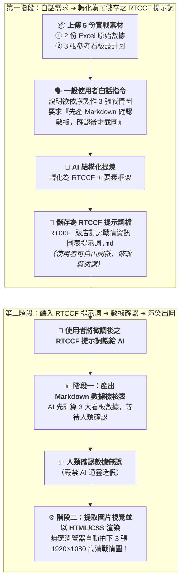

# 9-1 白話自然語言發想提示詞（生成可儲存之 RTCCF 提示詞規格）

> 💡 **核心精神**：在真實職場中，一般使用者並不需要事先具備提示詞工程或前端程式碼技術！  
> 只要**「上傳 5 份實作素材 ＋ 一段日常生活白話需求 ➔ AI 自動轉化為標準 RTCCF 提示詞規格檔」**！  
> 這個規格檔**可以儲存為獨立 Markdown 檔案**，方便使用者檢視、微調與進行人機協作。修改確認後，再將這份 RTCCF 提示詞餵給 AI 執行！
> 
> *註：本案例示範採用虛擬企業名稱「**星嵐大飯店（StarShore Hotel）**」進行去識別化呈現。*

---

## 🎯 核心工作流：人機協作雙閉環



---

## 📋 提示詞複製專區（一般人口語化自然語言）

學員在 AI 對話視窗（ChatGPT Plus / Claude / Gemini Advanced）中，**先上傳 5 個實作素材檔案**：
1. `2026 黑卡透過LINE客服訂房紀錄(樞紐分析).xlsx`（1,163 筆流水帳）
2. `2026 黑卡透過LINE客服訂房每月紀錄.xlsx`（月度預算與 ADR 比較表）
3. `參考範本_看板1_各館房晚前三名.jpg`（看板 1 參考圖）
4. `參考範本_看板2_量價走勢與YoY.jpg`（看板 2 參考圖）
5. `參考範本_看板3_ADR達成率與洞察.jpg`（看板 3 參考圖）

上傳完成後，直接複製並貼上以下這段大白話發想指令：

```text
你好，我是星嵐大飯店（StarShore Hotel）總經理室的營運分析師。

我已經把這次專案需要的 5 個檔案全部上傳給你了：
1. 《2026 黑卡透過LINE客服訂房紀錄(樞紐分析).xlsx》：包含 1,163 筆真實黑卡訂房流水帳明細。
2. 《2026 黑卡透過LINE客服訂房每月紀錄.xlsx》：包含 2024~2026 各月預算目標、營收與 ADR 比較表。
3. 《參考範本_看板1_各館房晚前三名.jpg》：看板 1 參考設計圖（雙欄會員偏好與金銀銅牌榜）。
4. 《參考範本_看板2_量價走勢與YoY.jpg》：看板 2 參考設計圖（量價雙軸走勢圖與 YoY 柱狀圖）。
5. 《參考範本_看板3_ADR達成率與洞察.jpg》：看板 3 參考設計圖（ADR 達成率柱狀圖、對照表與商業洞察）。

我想請你扮演「頂級商業視覺工程師與提示詞專家」，幫我把以下這段口語工作需求，整理並產出一份標準「RTCCF 格式」的提示詞規格檔，並以 Markdown 檔案格式提供給我儲存，方便我後續檢視、修改與進行人機協作：

【我的核心任務與防錯要求】：
1. 我要依序為星嵐大飯店製作 3 張高階行動戰情看板圖（1920×1080 規格，適合手機與通訊軟體閱讀）：
   - 看板 1：福福卡與波波卡 1-8 月各館訂房房晚數前三名（雙欄排列、KPI 方塊與獎牌長條圖）
   - 看板 2：2026 年 1-8 月訂房成效分析 By Book Day（間數與營收雙軸走勢、YoY 成長長條圖）
   - 看板 3：2026 目標 ADR 達成率與 2025 ADR 差異分析（月度柱狀圖、明細對照表、4 點商業決策洞察 Key Takeaways）
2. ⚠️ 關鍵防通靈與數據防錯機制（兩階段執行）：
   - 當要生成圖片時，請「絕對不要直接出圖」！
   - 第一階段：AI 必須先讀取 Excel 數據並核算所有數值，先產生 1 個 Markdown 檔案（如《飯店訂房戰情看板數據檢核表.md》），將 3 大看板的所有數據、百分比與商業洞察完整條列，停下來讓我（使用者）確認！
   - 第二階段：只有當我在對話框中回覆「確認數據無誤」之後，AI 才可以提取 3 張參考圖片中的視覺風格（深海藍 #0B2545 Header、字型層級、卡片圓角、陰影與雙軸圖表格式），將數據注入現代 HTML/CSS 網頁，最後透過無頭瀏覽器自動拍下 3 張 1920×1080 高清 PNG 圖檔供我下載。

請將以上需求轉化為結構清晰、專業且可直接儲存執行的「RTCCF 提示詞規格」（包含 Role 角色、Task 任務、Context 背景、Constraints 限制、Format 輸出格式），請直接輸出為可儲存的 Markdown 內容，謝謝！
```

---

## 💡 為什麼要將提示詞轉為「可儲存之 RTCCF 檔案」？

1. **落實人機協作（Human-in-the-loop）**：  
   AI 整理出來的 RTCCF 提示詞，使用者可以在本地文字編輯器（VS Code、記事本或 Markdown 編輯器）中自由修改。例如：微調色系編號、調整指標計算公式或指定特約館別名稱，修改後再餵給 AI，確保最終產出 100% 符合業務需求！
2. **標準五要素防護，杜絕通靈**：  
   透過 RTCCF 框架嚴格鎖定「先產 Markdown 數據檢核表 ➔ 人類審查確認 ➔ 確認後才渲染出圖」，徹底避免 AI「自己幻想數據並直接畫出漂亮假圖」的致命缺陷！
3. **流程可沉澱與複用**：  
   儲存下來的 `RTCCF_飯店訂房戰情資訊圖表提示詞.md` 可以作為企業內部的標準作業規範（SOP），下個月換成 1~9 月最新 Excel 數據時，直接再次呼叫執行即可！
