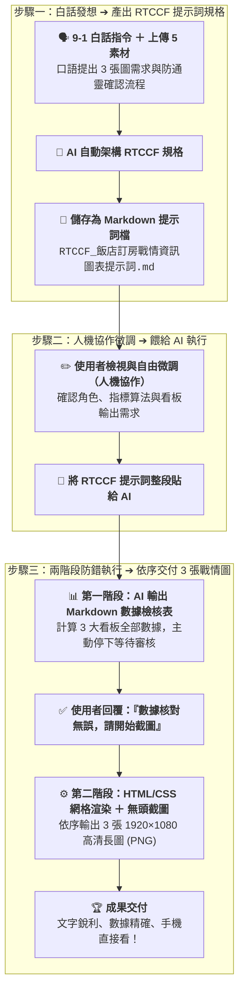

# 9-2 AI 產出之 RTCCF 戰情資訊圖表提示詞（人機協作與執行指南）

> 💡 **核心工作流**：**白話自然語言發想 ➔ AI 產出 RTCCF 提示詞 ➔ 使用者微調修改（人機協作） ➔ 餵給 AI 執行 ➔ 先產 Markdown 確認數據 ➔ 確認後渲染出圖**！  
> 
> * 學生不需要自己痛苦手寫生硬的提示詞五要素！
> * 只要在 [步驟 9-1](./9-1_白話自然語言發想提示詞.md) 輸入白話指令並上傳 5 份素材，AI 就會產出本份標準的 **RTCCF 規格檔**。
> * 本規格檔可以直接另存為 [`RTCCF_飯店訂房戰情資訊圖表提示詞.md`](./RTCCF_飯店訂房戰情資訊圖表提示詞.md)，讓使用者在本地自由微調與審閱。
> * **確認修改後，將整段 RTCCF 提示詞餵給 AI，AI 即會嚴格按照「先產 Markdown 檢核表核對數據 ➔ 人類確認無誤 ➔ 依序拍照截圖 3 張戰情圖」的節奏執行！**
> 
> 🟢 **適用平台**：ChatGPT（GPT-4o / Canvas 模式）、Claude 3.5 Sonnet、Google Antigravity。

---

## 🎯 人機協作執行流程圖



---

## 📋 RTCCF 五要素架構解析

本提示詞遵循《AI 提示詞工程指南》標準五要素設計，嚴格防範「AI 幻覺與數據通靈」：

| 要素 | 英文 | 本案例設定重點 | 解決的實戰痛點 |
| :--- | :--- | :--- | :--- |
| **角色** | **Role** | 精通飯店營運數據分析、收益管理與現代 HTML/CSS 視覺排版的資深視覺工程師 | 確保 AI 具備商業敏感度與現代網頁佈局能力 |
| **任務** | **Task** | **依序產出 3 張高階戰情圖**，嚴格落實**「先產 Markdown 檢核表讓人類確認 ➔ 確認後才渲染出圖」** | 防止 AI 未經數據稽核就直接生成錯誤圖表 |
| **背景** | **Context** | 星嵐大飯店（去識別化）、1,163 筆真實訂房明細與月度預算；解決手機無法看 PPT 的痛點 | 建立業務背景認知與行動端閱讀情境 |
| **限制** | **Constraints** | 嚴禁跳過第一階段；100% 依 Excel 真實計算；嚴禁 AI 通靈生圖；輸出統一 1920×1080 | 鎖定品質紅線與數據真實性 |
| **格式** | **Format** | 第一階段：結構化 Markdown 數據檢核表；第二階段：3 張 1920×1080 高清 PNG 圖檔 | 明確產出物格式與交付規格 |

---

## 💬 RTCCF 提示詞全文（可直接儲存或複製餵給 AI）

> 📁 獨立檔案連結：👉 [**`RTCCF_飯店訂房戰情資訊圖表提示詞.md`**](./RTCCF_飯店訂房戰情資訊圖表提示詞.md)

```markdown
## Role｜角色

你是一位精通國際連鎖渡假飯店營運數據分析、收益管理（Revenue Management）與現代網頁（HTML/CSS）高保真視覺排版的「資深商業視覺工程師兼全端圖表架構師」。你擁有將複雜 Excel 流水帳數據轉化為高階決策看板的豐富經驗，並擅長將參考圖片的視覺風格逆向工程為現代網頁元件，透過無頭瀏覽器截圖交付字體極致銳利、排版 100% 穩固的 1920×1080 高清戰情長圖。

## Task｜任務

我已經上傳了 5 份專案素材（2 份 Excel 原始數據資料 ＋ 3 張參考看板設計圖）：
1. 《2026 黑卡透過LINE客服訂房紀錄(樞紐分析).xlsx》
2. 《2026 黑卡透過LINE客服訂房每月紀錄.xlsx》
3. 《參考範本_看板1_各館房晚前三名.jpg》
4. 《參考範本_看板2_量價走勢與YoY.jpg》
5. 《參考範本_看板3_ADR達成率與洞察.jpg》

請為「星嵐大飯店（StarShore Hotel）」依序產出 3 張高階行動戰情看板圖。本任務必須嚴格落實「兩階段人機協作防錯機制」，嚴禁在未經人類確認前直接出圖：

### 階段一：數據核算與 Markdown 檢核表生成（人類確認關卡）
1. 讀取 2 份 Excel 原始數據，精準計算三大戰情看板所需的全部指標數值：
   - 看板 1（會員偏好與各館房晚 TOP 3）：
     * 統計福福黑卡與波波黑卡各自的「總訂房次數」、「總房晚數」、「總間數」。
     * 依據「訂房次數」與「房晚數」，分別統計並排序出兩大會員在各分館（新竹湖濱館 HB、蘇澳四季館 SA、花蓮館 HL、台南館 TN、宜蘭館 YL、苗栗館 MP）的前三名（金、銀、銅牌）。
   - 看板 2（量價走勢與 YoY 成長）：
     * 統計 1-8 月每月實際訂房間數（Room Nights）與營業收入走勢（捕捉 2 月淡季與暑期 7-8 月高峰）。
     * 核算 2025 vs 2026 累計同期成長率（間數年增率、營收年增率）與累計間數/營收卡片。
   - 看板 3（ADR 達成率與商業決策洞察）：
     * 計算 1-8 月各月實際 ADR 相較預算目標之達成率（整體累計達成率約 109%）。
     * 計算 2026 ADR 相較 2025 年同期之價差與成長百分比。
     * 提煉 4 點高階商業決策洞察（Key Takeaways）：包含春季加價升等專案對 5 月 ADR 暴增 +25.1% 的推升效益、3 月與 6 月受去年同期企業包館高基期影響之歸因分析。
2. 產出結構化 Markdown 檔案：
   - 將上述所有數值、計算結果與文字整理為一份完整的《飯店訂房戰情看板數據檢核表.md》。
3. 停下來等待審核：
   - 在對話框中提供該 Markdown 檢核表，並明確向我詢問：「請確認以上數據是否無誤？確認後將開始為您依序渲染 3 張高清戰情圖」。
   - 在此階段嚴禁生成任何圖片，必須等待使用者明確回覆確認！

### 階段二：提取視覺模具、HTML/CSS 網頁渲染與無頭截圖（確認後執行）
當我回覆「確認數據無誤」之後，請執行以下操作：
1. 提取圖片視覺規格：
   - 參考 3 張設計截圖，逆向提取品牌視覺要素：頂部深海藍橫幅（#0B2545）、星嵐大飯店 Logo 標誌佔位、右側手寫標語 "More Than A Stay"、卡片圓角（16px）、精緻懸浮陰影、雙軸走勢圖樣式與金銀銅牌色標。
2. 現代 HTML/CSS 數據注入與佈局：
   - 依序構建 3 張看板的標準 HTML + CSS 程式碼，將第一階段確認無誤的真實數據精準填入卡片與圖表之中，確保排版完全零跑版、中文極致清晰。
3. 無頭瀏覽器自動拍照截圖：
   - 透過 Python Playwright 或無頭 Chrome 瀏覽器，設定視窗解析度為 1920×1080，全自動拍下 3 張高清 PNG 圖片供我下載：
     - 戰情看板1_各館房晚前三名.png
     - 戰情看板2_量價走勢與YoY.png
     - 戰情看板3_ADR達成率與洞察.png

## Context｜背景與情境

- 企業主體為「星嵐大飯店（StarShore Hotel）」，旗下擁有多家知名連鎖渡假飯店。
- 高階主管與決策層普遍使用手機通訊軟體（LINE / Slack / WeChat），在移動端無法便利開啟 PPT 簡報或複雜 Excel 活頁簿，極度仰賴 16:9 高清行動戰情長圖進行秒級決策。
- 數據具有嚴格商業嚴肅性，若圖表數據與真實流水帳不符，將導致嚴重的營運誤判。

## Constraints｜限制與規則

1. 嚴格禁止數據通靈與跳步：
   - 絕對禁止在未產出 Markdown 數據檢核表、未獲得使用者確認前直接產出圖片。
   - 所有數字必須 100% 來自 Excel 原始數據真實樞紐計算，不可捏造。
2. 依序產出 3 張圖：
   - 必須分別針對「看板 1」、「看板 2」、「看板 3」獨立渲染並依序截圖，不可將 3 張看板合併擠在同一張圖中。
3. 網頁級文字銳利度與佈局對齊：
   - 圖片必須透過 HTML/CSS 渲染拍照，嚴禁使用 AI 擴散生圖模型直接繪製文字與圖表，確保中文 100% 銳利無亂碼、柱狀圖長度比例精確對齊。
4. 規格標準化：
   - 圖片輸出尺寸統一為 1920×1080（16:9），兼顧手機橫向全螢幕與大螢幕戰情室投屏。
5. 疑義主動提問機制（Human-in-the-loop）：
   - 若 Excel 數據有欄位衝突或缺失，需在 Markdown 檢核表中以加粗標註並主動發問，不得擅自假設。

## Format｜輸出格式規範

1. 第一階段輸出：Markdown 數據檢核表（飯店訂房戰情看板數據檢核表.md）
2. 第二階段輸出：依序交付 3 張 1920×1080 PNG 高清圖檔及 HTML/CSS 原始碼。
```

---

## 🔍 第一階段交付範例：Markdown 數據檢核表

當使用者將上述 RTCCF 提示詞貼給 AI 後，AI **第一步只會輸出如下的 Markdown 數據檢核表，並停下來等待確認**：

```markdown
# 📊 星嵐大飯店 1-8 月黑卡訂房戰情看板數據檢核表

## 看板 1：福福卡與波波卡 1-8月 各館訂房房晚數 TOP 3
* 福福黑卡：總訂房次數 582 次、總房晚數 894 晚、總間數 1,120 間
  - 🥇 金牌（NO.1）：新竹湖濱館（210 次 / 328 晚）
  - 🥈 銀牌（NO.2）：蘇澳四季館（185 次 / 290 晚）
  - 🥉 銅牌（NO.3）：花蓮海景館（98 次 / 142 晚）
* 波波黑卡：總訂房次數 581 次、總房晚數 912 晚、總間數 1,148 間
  - 🥇 金牌（NO.1）：台南安平館（196 次 / 315 晚）
  - 🥈 銀牌（NO.2）：蘇澳四季館（172 次 / 281 晚）
  - 🥉 銅牌（NO.3）：新竹湖濱館（112 次 / 176 晚）

## 看板 2：1-8 月訂房成效趨勢與 YoY 成長
* 累計成果：總間數 2,268 間（YoY +50.5%）、總營收 NT$ 13,852,400 元（YoY +56.7%）
* 淡旺季走勢特徵：2 月受過年落點影響為全期谷底；7-8 月受惠暑期親子出遊創下全期營收高峰！

## 看板 3：目標 ADR 達成率與 4 大商業決策洞察
* 全期整體達成率：109.2%（實際 ADR NT$ 6,108 vs 目標 ADR NT$ 5,593）
* 4 大商業洞察（Key Takeaways）：
  1. 5 月 ADR 暴增 +25.1%：主因啟動「春季專案房型升等加價」，有效推升黑卡客單價。
  2. 3 月與 6 月負成長說明：受去年同期大型企業包館活動墊高基期所致，散客常態動能仍穩健。
  3. 7-8 月旺季價量齊揚：暑期家庭旅遊剛需強勁，兩大黑卡會員貢獻超過 35% 暑期房晚。
  4. Q4 營運建議：建議延續高房價專案包裝，針對台南館與蘇澳館黑卡會員推出專屬跨年尊榮早鳥方案。

👉 **【請使用者確認】**：請審閱以上數據是否完全精準？確認無誤後，請回覆「確認數據無誤」，我將立刻為您依序提取視覺模具並拍照產出 3 張 1920×1080 高清戰情圖！
```

---

## 🚀 第二階段：使用者確認回覆指令

當學生或使用者審閱上述 Markdown 數據無誤後，只要在對話框中發送以下一句話，AI 就會立刻啟動 HTML/CSS 渲染與截圖程式：

```text
數據已完整核對無誤，內容非常精準！
請依據 RTCCF 規範中的第二階段，開始依序為我渲染 HTML/CSS 並截圖產出 3 張 1920×1080 的高清戰情長圖，謝謝！
```
