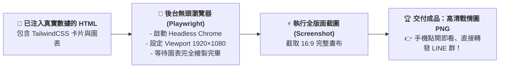

# 9-3 無頭瀏覽器截圖產出高清戰情圖

> 🏆 **本單元核心技術**：**無頭瀏覽器自動化拍照（Headless Browser Snapshot）**  
> 讓 AI 在後台利用 Chrome / Playwright 引擎，以 1920×1080 規格將 HTML 網頁拍成零毛邊、極致清晰的 16:9 高清資訊戰情圖！

---

## 💡 什麼是「無頭瀏覽器（Headless Browser）」？

「無頭（Headless）」指的是**「沒有顯示器介面、只在後台默默運行的瀏覽器」**：
1. **背景默默啟動**：AI 在雲端後台啟動一個隱藏版的 Chrome 瀏覽器。
2. **載入剛剛生成的 HTML 頁面**：精準渲染出深藍 Header、圓角卡片與圖表。
3. **固定視窗解析度（Viewport）**：設定寬度為 `1920`、高度為 `1080`（標準 16:9 Full HD）。
4. **喀嚓！拍下截圖並存檔**：1 秒鐘內截圖儲存為 `星嵐大飯店_訂房成效戰情圖_已完成.png`，直接提供給使用者下載！

---

## 📋 自然語言一鍵截圖產檔提示詞（傳送給 AI 執行）

學生在對話視窗中，直接使用這段自然語言指令，AI 就會在後台自動執行渲染並截圖：

```text
請將前面已整理好的 HTML 視覺頁面，直接在後台使用無頭瀏覽器（如 Playwright 或 Chrome 截圖引擎）進行渲染，並產出一張 1920x1080 解析度的高清圖片：

1. 圖片格式：PNG（高品質、文字邊緣無失真壓縮）。
2. 畫面尺寸：嚴格鎖定 1920 寬度與 1080 高度（標準 16:9）。
3. 輸出檔名：請命名為「星嵐大飯店_2026年1-8月黑卡訂房成效戰情圖_已完成.png」。
4. 請直接執行並提供下載連結！
```

---

## 🗺️ 後台運作核心架構圖（秒懂自動化閉環）

學生不需要學寫代碼，只要了解 AI 在後台替你完成的工作流：



---

## 📱 職場成果應用情境（手機 LINE 群推播範例）

當產出高清 `.png` 檔案後，出納與營運幕僚可以直接在通訊軟體中發送：

> 📢 **【星嵐大飯店 1-8月 LINE VIP 黑卡訂房即時戰報】**  
> 各位長官好，本期黑卡會員訂房成效摘要如下：  
> 1. **量價齊揚**：累計訂房 1,562 間（年增 +50.5%），營收突破 890 萬元（年增 +56.7%）！  
> 2. **ADR 表現亮眼**：整體目標達成率 109%，5 月成長達 +25.1%。  
> 3. **熱門館別**：波波黑卡首選台南館（601 房晚），福福黑卡首選蘇澳四季館。  
> 
> *(詳細戰情儀表板請參閱附圖)* ⬇️  
> 🖼️ `[星嵐大飯店_2026年1-8月黑卡訂房成效戰情圖_已完成.png]`

**不用等長官回到電腦前開 Office，在手機通訊軟體裡就能完成高階決策溝通！**
