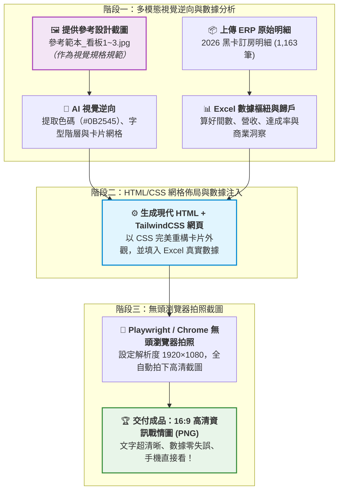

# 實戰範例：飯店訂房營運戰情資訊圖表自動化（HTML/CSS 視覺渲染與無頭截圖）

> [!NOTE]
> 🛡️ **去識別化與隱私保護聲明**：  
> 本實戰案例之原始數據源自國內知名連鎖渡假酒店之真實營運月報素材。為保護商業機密與顧客隱私，本教學之說明文件、提示詞指令範本及最終產出的圖表，均統一採用虛擬企業名稱「**星嵐大飯店（StarShore Hotel）**」進行去識別化示範，完整保留數據結構與高階分析決策之實戰精髓！

> 🟢 **採用代理平台**：ChatGPT Agent / Claude.ai / Google Antigravity  
> 🛠️ **建議執行模式**：**多模態以圖生圖 ＋ 網頁級精準渲染**（**參考圖片視覺逆向** ➔ **HTML/CSS 注入數據** ➔ **無頭瀏覽器拍照截圖**）

---

## 📥 學員實戰素材下載專區

學生在進行本單元實作時，可下載以下原始素材進行完整演練：

> * 🗂️ **【一鍵全打包下載】實作素材懶人包（推薦一次下載解壓縮）**：  
>   👉 [**`素材.zip`**](./素材.zip) *(打包全部 5 個檔案：2 份 Excel 原始數據 ＋ 3 張參考看板設計圖)*

* 📦 **【個別檔案下載】練習必備數據素材（請下載這 2 個 Excel 檔案開始實作）**：  
  1. 👉 [**`2026 黑卡透過LINE客服訂房紀錄(樞紐分析).xlsx`**](./素材/2026%20黑卡透過LINE客服訂房紀錄(樞紐分析).xlsx) *(包含 1,163 筆真實訂房明細、會員別、房晚、間數與各館統計)*  
  2. 👉 [**`2026 黑卡透過LINE客服訂房每月紀錄.xlsx`**](./素材/2026%20黑卡透過LINE客服訂房每月紀錄.xlsx) *(包含 2024~2026 各月預算目標、營收達成率與 ADR 比較表)*  

* 🖼️ **【視覺樣板起點】參考設計圖（作為 AI 視覺排版之風格依據，資料夾內亦保留原始檔名）**：  
  1. 👉 [**`參考範本_看板1_各館房晚前三名.jpg`**](./素材/參考範本_看板1_各館房晚前三名.jpg) *(原檔名：`725043_0.jpg`｜看板 1：雙欄會員偏好與金銀銅牌榜)*  
  2. 👉 [**`參考範本_看板2_量價走勢與YoY.jpg`**](./素材/參考範本_看板2_量價走勢與YoY.jpg) *(原檔名：`725044_0.jpg`｜看板 2：量價雙軸走勢圖與 YoY 柱狀圖)*  
  3. 👉 [**`參考範本_看板3_ADR達成率與洞察.jpg`**](./素材/參考範本_看板3_ADR達成率與洞察.jpg) *(原檔名：`725045_0.jpg`｜看板 3：ADR 達成率柱狀圖、對照表與商業洞察)*

---

## 🏆 最終完成成果展示（行動戰情圖搶先看）

本專案解決企業高階主管「**在手機通訊軟體（LINE/Slack/微信）中無法方便開啟 PPT 簡報、只想秒看高清視覺戰情卡片**」的重大職場剛需。產出具備**品牌標準色系、量價雙軸指標、文字 100% 銳利精準且完全零跑版**的 1920×1080 高清長圖：

### 📊 三大行動戰情看板展示

#### 看板 1：【福福卡與波波卡 1-8月 各館訂房房晚數前三名】
*雙欄並列兩大頂級會員客群，直觀呈現訂房次數與房晚數的 TOP 3 獎牌榜：*

#### 看板 2：【2026年 1-8月 訂房成效分析 By Book Day】
*左側為間數與營收之雙軸走勢圖（捕捉 2 月淡季與 7~8 月暑假高峰）；右側為 YoY 成長長條圖（間數 +50.5%，營收 +56.7%）：*

#### 看板 3：【2026 目標 ADR 達成率與 2025 ADR 差異分析】
*上層為 ADR 達成柱狀折線圖；下層左側為明細對照表，右側為提煉出的 4 大商業決策洞察（Key Takeaways）：*

---

## 🎯 為什麼資訊圖表要採用「HTML/CSS 網頁渲染 ➔ 截圖」？

### ❌ 傳統生圖模型（DALL-E / Midjourney）的致命傷：
1. **中文字體崩潰**：中文會變成外星亂碼或扭曲符號。
2. **數據通靈造假**：長條圖長度與折線趨勢完全無法與 Excel 真實數字對齊。
3. **無法商業落地**：一張數字胡謅的圖，無法呈報給總經理。

### ✅ 現代 HTML/CSS 截圖黑科技的巨大優勢：
1. **結構 100% 精準對齊**：網頁的 Flexbox 與 Grid 佈局是全世界最穩健的排版工具，卡片圓角、陰影、邊界永遠整齊。
2. **數據 100% 真實可靠**：文字與圖表是由 Python 讀取真實 Excel 算出來後動態填入，完全不通靈。
3. **文字極致清晰**：瀏覽器截圖產出的是 1920×1080 高清向量渲染圖，文字邊緣銳利不模糊。
4. **手機推播體驗第一名**：產出的 PNG 圖片可直接貼在 LINE、微信、Slack 或 Email 中，主管手機點開即秒懂！

---

## ⚡ 核心運作流程圖（以圖生圖 ➔ HTML/CSS 渲染 ➔ 高清截圖）

---

## 📋 實戰步驟指引

### 1. 步驟 1：以圖生圖白話自然語言提示詞
* 文件連結：[**`9-1_以圖生圖白話自然語言發想提示詞.md`**](./9-1_以圖生圖白話自然語言發想提示詞.md)
* 核心操作：學生只要上傳參考截圖與最新 Excel 數據，用口語告訴 AI「請參考這張圖片的排版與色票，用新數據做出一模一樣的高清戰情圖」。

### 2. 步驟 2：AI 產出 HTML/CSS 視覺佈局規範
* 文件連結：[**`9-2_HTML與CSS網格排版生成提示詞.md`**](./9-2_HTML與CSS網格排版生成提示詞.md)
* 核心技術：了解 AI 如何將圖片逆向工程為標準 HTML/CSS 程式碼，確保深海藍 Header、卡片圓角與雙軸圖表格式永久統一。

### 3. 步驟 3：無頭瀏覽器自動截圖產檔
* 文件連結：[**`9-3_無頭瀏覽器截圖產出高清戰情圖.md`**](./9-3_無頭瀏覽器截圖產出高清戰情圖.md)
* 核心技術：透過 Python Playwright 進行後台無感截圖，10 秒鐘交付 1920×1080 高清戰情圖實體圖片！

---

## 📁 範例交付成品與素材清單

| 檔案名稱 | 檔案類型 | 角色與說明 |
| :--- | :---: | :--- |
| 🗂️ [**素材.zip**](./素材.zip) | 🗂️ **一鍵打包下載** | **【懶人推薦】** 內含本單元 5 個素材檔案（2 份 Excel ＋ 3 張參考圖）之完整壓縮包 |
| 📦 [**2026 黑卡透過LINE客服訂房紀錄(樞紐分析).xlsx**](./素材/2026%20黑卡透過LINE客服訂房紀錄(樞紐分析).xlsx) | 📁 **實作原始數據** | **【實作起點】** 包含 1,163 筆真實訂房明細、會員別、房晚、間數與各館統計 |
| 📦 [**2026 黑卡透過LINE客服訂房每月紀錄.xlsx**](./素材/2026%20黑卡透過LINE客服訂房每月紀錄.xlsx) | 📁 **實作目標數據** | **【實作起點】** 包含 2024~2026 各月預算目標、營收達成率與 ADR 比較表 |
| 🖼️ [**參考範本_看板1_各館房晚前三名.jpg**](./素材/參考範本_看板1_各館房晚前三名.jpg) | 🖼️ **視覺樣板參考** | 看板 1 參考截圖：福福卡與波波卡各館訂房房晚數前三名 |
| 🖼️ [**參考範本_看板2_量價走勢與YoY.jpg**](./素材/參考範本_看板2_量價走勢與YoY.jpg) | 🖼️ **視覺樣板參考** | 看板 2 參考截圖：量價雙軸走勢圖與 YoY 柱狀圖 |
| 🖼️ [**參考範本_看板3_ADR達成率與洞察.jpg**](./素材/參考範本_看板3_ADR達成率與洞察.jpg) | 🖼️ **視覺樣板參考** | 看板 3 參考截圖：ADR 達成率柱狀圖、對照表與商業洞察 |
| 💬 [**9-1_以圖生圖白話自然語言發想提示詞.md**](./9-1_以圖生圖白話自然語言發想提示詞.md) | 💬 **人機發想** | 學生提供圖片與 Excel，引導 AI 逆向排版之白話指令 |
| 📋 [**9-2_HTML與CSS網格排版生成提示詞.md**](./9-2_HTML與CSS網格排版生成提示詞.md) | 📋 **視覺佈局** | 解說 HTML/CSS 如何精準還原卡片圓角、陰影與雙軸圖表之排版提示詞 |
| ⚙️ [**9-3_無頭瀏覽器截圖產出高清戰情圖.md**](./9-3_無頭瀏覽器截圖產出高清戰情圖.md) | ⚙️ **截圖產檔** | 結合 Playwright 自動化截圖，一鍵輸出 1920×1080 高清戰情圖成果 |

---

[← 返回實戰範例導覽總表](../README.md)
