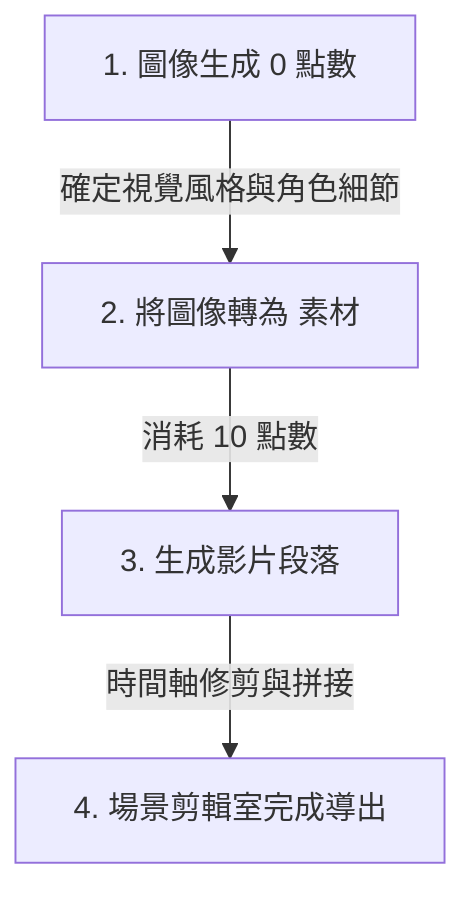

# Google Flow 2026 全攻略：AI 影音生成與改版教學

這份指南詳細解析了 **Google Flow 2026** 全新大改版的介面設計、核心功能與進階影音生成技巧。透過介面整合與自動化工作流，創作者能以更低成本、高效率的方式產出專業級的影音內容。

---

## 📌 核心更新總覽

| 亮點功能 | 核心特色 | 創作實務建議 |
| :--- | :--- | :--- |
| **近乎零成本圖像創作** | 專案內生成圖片消耗 0 點額度，但有每日上限。 | 適合用來密集試錯、探索視覺風格與角色細節。 |
| **角色資產 (Character Assets)** | 建立角色文件庫，包含臉部、體態、語音與性格。 | 徹底解決 AI 繪圖常見的「角色跑版」問題。 |
| **進階影片生成** | 提供幀模式與元素模式，支援「手尾針」動態控制。 | 利用「起始＋結束」圖像精確導引角色動作。 |
| **AI Agent 與虛擬分身** | 對話式自動化生成，一鍵完成腳本、分鏡至影片。 | 手機掃描即可快速建立專屬風格的虛擬替身。 |
| **場景剪輯室 (Scene Editor)** | 將影片生成與時間軸剪輯完美整合。 | 完成影片段落生成後，直接在 Flow 內修剪與拼接。 |

---

## 🔍 五大戰略級更新詳解

### 🎨 亮點一：近乎零成本的圖像創作力與流量預警
目前在專案中生成圖片，系統顯示消耗 **`0 點`** 信用額度（Credits），為尋找視覺風格的創作者提供了極佳的實驗場。

* **每日配額限制**：
  * **免費帳號**：每日上限約 **100 張**。
  * **付費訂閱帳號**：每日上限約 **500 張**（擁有更高生成優先權）。

> [!WARNING]
> **流量防護限制**
> 若在短時間內密集輸入提示詞，系統會判定為惡意刷流量並觸發防護機制，跳出警告：**「你生成的速度太快，請稍後再試。」** 建議生成時保持適當節奏，避免操作中斷。

---

### 👥 亮點二：「角色資產 (Character Assets)」與生成一致性革命
過去 AI 繪圖最令人頭痛的「角色跑版（Character Consistency）」問題，在此版本中提升到了「資產管理」的維度。

1. **介面操作邏輯**：
   * **圖內編輯（下方輸入框）**：僅適用於**局部修正**（例如：替角色的沙發換色或微調局部光影）。
   * **專案介面生成**：在主提示框使用 `Add to Prompt` 並附加參考圖，用以**維持跨場景角色的連貫性**。
2. **角色資產中心（左側邊欄第 4 個圖示）**：
   * **外型定義 (Portrait & Body)**：確保角色在各種角度下的臉部與體態穩定性。
   * **語音與性格 (Voice & Personality)**：設定角色的專屬音色與行為邏輯。

> [!NOTE]
> **中文語音優化建議**
> 目前中文語音合成有時會出現腔調較不自然的情況。建議在角色的性格與行為描述中，加入更細膩的語速設定或情緒標記來進行修正。

---

### 🎬 亮點三：進階影片生成——從「抽盲盒」到「精準導演」
新版影片生成模組提供了更高的操控性，特別是針對動態軌跡的精確控制。

1. **兩種生成邏輯**：
   * **幀模式 (Frames to Video)**：以單圖為基礎的延伸，動作幅度相對保守穩定。
   * **元素模式 (Ingredients to Video)**：將圖片視為「演員」或「道具」。AI 會提取圖像核心特徵（如髮型、穿搭），但允許畫面產生更劇烈、更具張力的動態。
2. **「手尾針 (First-Last Frame)」技法與模型選用**：
   * 輸入第一張圖（起始位）與最後一張圖（結束位），讓 AI 自動補足中間的過渡動作。

> [!IMPORTANT]
> **手尾針模型限制與成本**
> * **支援模型**：目前提供 `omni`、`flash`、`vo3.1 light`、`vo3.1 fast`、`vo3.1 quality` 等模型。
> * **關鍵警告**：**Omni 模型雖然光影質感最優，但暫時不支援手尾針功能！** 若需精確控制角色動作位移，請務必選用 **`vo3.1` 系列模型**。
> * **生成成本**：生成一段約 6 秒的影片約需消耗 **`10 點`** 信用額度。

---

### 🤖 亮點四：AI Agent 與虛擬分身 (Avatar)
自動化工作流讓創作過程從「手動參數調整」升級為「對話式創作」。

* **AI Agent (代理人)**：在提示框中啟動 Agent 模式，只需輸入核心意圖（例如：*「拍一支貓咪飼料廣告」*），AI 就會以一問一答方式與創作者確認細節，並自動跑完腳本、分鏡、圖片生成到影片生成的全流程。
* **Avatar (虛擬分身)**：利用手機掃描建立個人的 3D 虛擬替身，並能輕易將自己置入「黏土風」、「賽博龐克」等任何藝術風格的場景中。

---

### ✂️ 亮點五：場景剪輯室 (Scene Editor) 與點數優化策略
新版內建 **場景 (Scenes)** 功能，實現了「生成與剪輯一體化」。創作者可將多段生成的影片直接拖入時間軸，進行修剪 (Trim)、拼接並導出成品。

💡 **推薦的點數優化策略**：

1. 先利用 **0 點數** 的圖像生成功能，多方嘗試並確定視覺風格與角色細節。
2. 確定滿意後，再將圖像作為「素材」匯入影片生成模組，消耗點數生成影片。
3. 最後進入場景剪輯室進行拼接，避免在無效的影片生成上虛耗點數。

---

## 📈 信用額度與未來展望
您可以在專案右上角的頭像查看目前的信用額度（Credits）餘額：
* **Pro 方案**：每月 1,000 點。
* **Ultra 方案**：每月 10,000 點。

在 Google Flow 全新的創作體系下，繁瑣的技術參數與剪輯流程已逐漸被 AI 自動化包辦。創作者未來的核心競爭力，將回歸到**定義角色的靈魂**以及**建構獨特的敘事觀點**。
