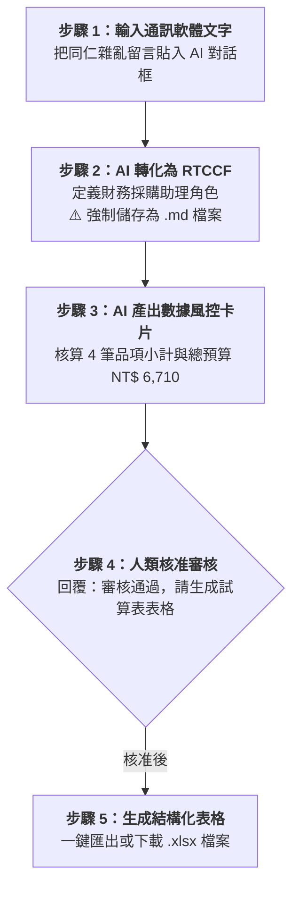

# 實戰範例 01：通訊軟體零碎採購需求清洗（Excel）

> 🟢 **適用代理平台**：Claude.ai / ChatGPT / Gemini / Google Antigravity  
> 🛠️ **建議執行模式**：**軌道一：Prompt 協作軌**（零碎口語訊息 ➔ RTCCF 數據清洗強制存為 `.md` ➔ 數據風控卡片 ➔ 匯出 Excel）

---

## 📥 學員實戰素材與交付成品

- **核心交付成品**：
  - [**`各部門零碎採購審核清單_已完成.xlsx`**](./各部門零碎採購審核清單_已完成.xlsx) *(由 AI 清洗、包含小計與總計連動公式之標準 Excel 活頁簿)*

---

## 🏆 案例情境與業務痛點

行政助理每週都要在 LINE / Slack 群組中面對同仁七嘴八舌的採購留言：
- 「業務部王大明想要買兩台微軟滑鼠，一台大概 850 元，下週三前要」
- 「行銷處小美說辦公室咖啡豆快沒了，要補 5 包耶加雪菲（每包約 420 元）跟 3 盒濾紙（每盒 120 元）」
- 「人資部陳主任說新人訓要印講義 30 本，每本影印費 85 元，預計 11 月 5 日請款」

若人工剪貼計算，常因單價、數量算錯或漏列急迫度而被主管退件。

---

## ⚡ 人機協商工作流程（Human-in-the-Loop）

---

## 📖 核心章節導覽

- **[步驟 1：1-1_白話自然語言發想提示詞.md](./1-1_白話自然語言發想提示詞.md)**  
  將通訊軟體口語文字交給 AI 處理之發想提示詞。
- **[步驟 2：1-2_AI產出之RTCCF採購清洗提示詞.md](./1-2_AI產出之RTCCF採購清洗提示詞.md)**  
  AI 生成之標準 RTCCF 數據清洗提示詞，**必須儲存為 `.md` 檔案**。
- **[步驟 3 & 4：1-3_數據風控審核卡片與Excel匯出提示詞.md](./1-3_數據風控審核卡片與Excel匯出提示詞.md)**  
  數據風控卡片範本、核准指令與四大平台匯出 Excel 教學。

---

[← 返回 Excel試算表生成模組](../README.md)
