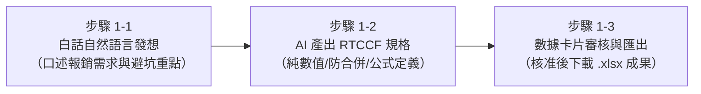

# 🟢 階梯一：基礎建表與運算（告別排版地雷與公式語法）
## 🎯 從零規格到標準資料庫型試算表：費用報銷與核銷管理

> **核心學習定位**：  
> 這是邁向 Excel 高手的第一哩路。過去初學者手動建表最容易踩入「亂合併儲存格」、「文字混雜金額導致無法加總」、「公式打錯語法」的三大地雷。  
> **現在，你只要懂一點點 Excel（直的是欄、橫的是列、能算數），透過口語告訴 AI，AI 就會替你規劃出最標準的資料庫型架構與動態公式！**

---

## ⚡ 學員有感痛點對比表（手動 vs. AI 協作）

| 檢驗維度 | 傳統手動痛點（以前好痛苦 😭） | AI 協作新體驗（現在好輕鬆 ✨） |
| :--- | :--- | :--- |
| **表格結構** | 隨意合併儲存格，導致後續要使用「資料篩選」或「排序」時跳出錯誤訊息完全不能動。 | 只要口語告知用途，AI 自動建構**禁止合併儲存格**的標準資料庫二維結構。 |
| **金額格式** | 手動輸入 `NT$ 3,500 元`，結果變成文字格式，用 `=SUM()` 加總出來永遠是 0。 | AI 自動設定純整數值，並配置標準千分位格式 `#,##0`，維持乾淨且可計算性。 |
| **計算方式** | 拿實體計算機算好小計再打上去，改了單價或數量，金額完全不會連動更新。 | AI 自動埋入動態公式（`=G5*H5`）與總計公式（`=SUM(I5:I14)`），修改立即動態重算。 |
| **時間成本** | 調整欄寬、格線、字體、對齊方式耗費 1 小時，還被財務退件。 | 一分鐘白話提示詞，30 秒產出符合會計稽核標準的完美 Excel。 |

---

## 🧭 實戰教學步驟（人機協作三步閉環）

1. **[步驟 1-1：白話自然語言發想提示詞](./1-1_白話自然語言發想提示詞.md)**  
   - 零門檻輸入！學員只需用最直白的日常語言，將主管要求與已知地雷告訴 AI。
2. **[步驟 1-2：AI 產出之 RTCCF 標準建表提示詞](./1-2_AI產出之RTCCF標準建表提示詞.md)**  
   - AI 自動升級為具備嚴密約束的 RTCCF 工程架構，強制儲存為 `.md` 保障跨平台零失真。
3. **[步驟 1-3：架構審核卡片與 Excel 範本生成提示詞](./1-3_架構審核卡片與Excel範本生成提示詞.md)**  
   - 透過「審核卡片」預檢欄位與公式，確認核准後一鍵生成標準 `.xlsx`。

---

## 📂 本單元隨附教材與實戰檔案

- 📝 **需求草案**：[素材_部門費用報銷需求與口語清單.md](./素材_部門費用報銷需求與口語清單.md)
- 📗 **標準交付成果**：[`部門差旅與專案費用報銷表_已完成.xlsx`](./部門差旅與專案費用報銷表_已完成.xlsx)
  - 內含：表頭識別、標準欄寬、斑馬紋背景、千分位數值、小計相乘公式、底端動態 SUM 總計。

---

[← 返回 Excel 全能實戰課程總導覽](../README.md)
