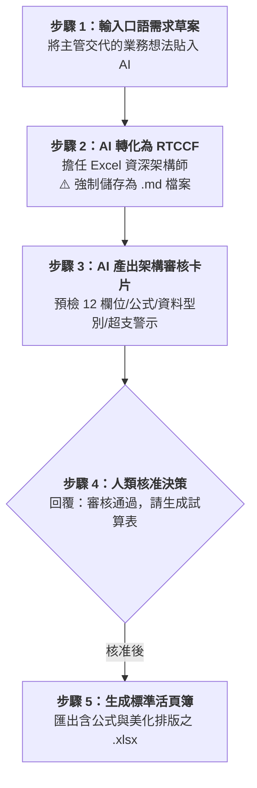

# 實戰階段一：無中生有——從零規格生成標準試算表（Excel）

> 🟢 **適用代理平台**：Claude.ai / ChatGPT / Gemini / Google Antigravity  
> 🛠️ **建議執行模式**：**自然語言規格化 ➔ RTCCF 建表（強制儲存為 `.md`）➔ 架構審核卡片 ➔ 匯出標準 Excel 活頁簿**

---

## 🎯 階段定位與學習目標

在職場中，我們經常遇到這種狀況：「手邊**沒有任何現成的 Excel 檔案**，網路上搜尋也只有幾張殘缺的截圖或部落格文字，主管只丟下一句『*幫我做一張能追蹤專案時程和預算花費的表，要有公式跟警示*』」。

這就是本階段要訓練的**「無中生有能力」**：
- **不用先學複雜函數**：用一般口語說明業務目的，由 AI 規劃標準資料欄位與型別。
- **自動植入商務計算公式**：主動要求 `=SUM()` 合計、`=AVERAGE()` 平均、`=預算 - 支出` 差異計算與百分比。
- **設計防呆與視覺階層**：規劃下拉選單選項（未開始/進行中/已完成/卡關延遲）與超支紅字警示。

---

## 🏆 案例情境與業務痛點

專案經理（PM）李思齊接下公司「2026 數位轉型跨部門專案（Project Horizon）」，跨足 IT、產品、行銷與人資四個部門。
- **痛點 1（格式混亂）**：過去各部門回報進度與花費各行其是，有的傳 LINE、有的傳 PPT 截圖，管理層無法即時掌握。
- **痛點 2（缺乏範本）**：公司沒有公版表格，李思齊上網搜尋只看到零碎的討論，不知該如何設計既專業又具備自動計算的試算表。
- **痛點 3（容易出錯）**：若自己手動刻表格，經常漏設公式、忘記數值千分位，或因格式不統一導致跨部門填寫時跑版。

---

## 📥 學員實戰素材（偽 Source File）

為了讓學員體驗從「模糊需求」到「標準規格」的過程，本階段提供模擬主管發送之內部需求備忘錄：

| 偽 Source 素材檔案 | 檔案格式 | 適用練習方式 |
| :--- | :---: | :--- |
| 📝 [**素材_專案預算與進度管理需求規格草案.md**](./素材_專案預算與進度管理需求規格草案.md) | Markdown | 支援直接拖曳至 Claude、ChatGPT、Gemini 或由 Antigravity 讀取。 |
| 📄 [**素材_專案預算與進度管理需求規格草案.txt**](./素材_專案預算與進度管理需求規格草案.txt) | 純文字檔 | 供無安裝 Markdown 檢視器之學員複製文字貼上。 |

---

## ⚡ 人機協商工作流程（Human-in-the-Loop）

---

## 📖 核心章節提示詞導覽（點擊查看並一鍵複製）

- **[步驟 1：1-1_白話自然語言發想提示詞.md](./1-1_白話自然語言發想提示詞.md)**  
  提供初學者直接向 AI 提出「無中生有」建表需求之自然語言模板。
- **[步驟 2：1-2_AI產出之RTCCF無中生有建表提示詞.md](./1-2_AI產出之RTCCF無中生有建表提示詞.md)**  
  AI 轉化出之高規格 RTCCF 提示詞，**必須儲存為 `.md` 檔案**。
- **[步驟 3 & 4：1-3_架構審核卡片與Excel範本生成提示詞.md](./1-3_架構審核卡片與Excel範本生成提示詞.md)**  
  數據架構審核卡片、人類核准指令與四大平台匯出 `.xlsx` 指引。

---

## 📦 核心交付成果

- 📗 [**`專案里程碑與預算進度管控表_已完成.xlsx`**](./專案里程碑與預算進度管控表_已完成.xlsx)  
  *(由 AI 生成之標準商務活頁簿，具備微軟正黑體排版、斑馬紋交錯底色、千分位數值、`=SUM()`、`=AVERAGE()` 與超支紅字警示)*

---

[← 返回 Excel試算表生成模組導覽](../README.md)
