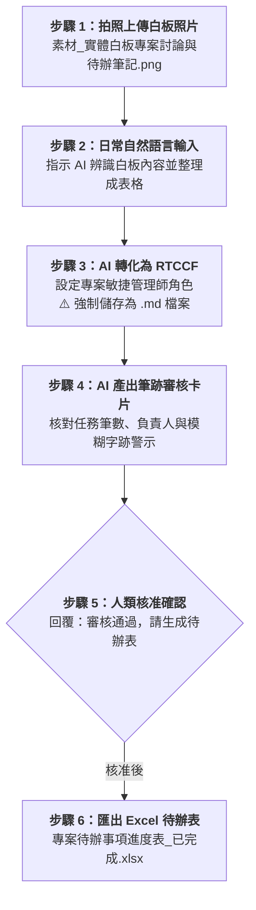

# 實戰範例 02：會議白板照片 OCR 辨識轉待辦清單（Excel）

> 🟢 **適用代理平台**：Claude.ai / ChatGPT / Gemini / Google Antigravity  
> 🛠️ **建議執行模式**：**多模態視覺 OCR 軌**（拍照上傳實體白板照片 ➔ 自然語言提需求 ➔ 轉 RTCCF 存為 `.md` ➔ 審核卡片確認 ➔ 匯出 Excel 待辦表）

---

## 📥 學員實戰素材與交付成品

- **必載輸入素材**：
  - [**`素材_實體白板專案討論與待辦筆記.png`**](./素材_實體白板專案討論與待辦筆記.png) *(實體會議室手寫白板照片，含任務、負責人、進度筆跡)*
- **核心交付成品**：
  - [**`專案待辦事項進度表_已完成.xlsx`**](./專案待辦事項進度表_已完成.xlsx) *(由 AI 多模態辨識筆跡後清洗產出之標準專案待辦 Excel 表)*

---

## 🏆 案例情境與業務痛點

專案會議結束後，白板上畫滿了待辦事項、負責人與排程日期：
1. **拍照後無人整理**：照片存在群組中，事後常因字跡潦草沒有人願意花時間打成 Excel。
2. **手動登打容易遺漏**：常常看錯縮寫、負責人或截止日期，導致專案進度延宕。
3. **AI 視覺辨識幻覺風險**：若沒有先經過人機協作審核卡片覆核，筆跡模糊處可能被 AI 誤判。

---

## ⚡ 人機協商工作流程（Human-in-the-Loop）

---

## 📖 核心章節導覽

- **[步驟 1：2-1_白話自然語言發想提示詞.md](./2-1_白話自然語言發想提示詞.md)**  
  上傳照片後，輸入白話辨識需求。
- **[步驟 2：2-2_AI產出之RTCCF白板辨識提示詞.md](./2-2_AI產出之RTCCF白板辨識提示詞.md)**  
  AI 生成之標準 RTCCF 多模態辨識提示詞，**必須儲存為 `.md` 檔案**。
- **[步驟 3 & 4：2-3_白板待辦審核卡片與Excel匯出提示詞.md](./2-3_白板待辦審核卡片與Excel匯出提示詞.md)**  
  筆跡審核卡片範本、核准指令與匯出 Excel 操作說明。

---

[← 返回 Excel試算表生成模組](../README.md)
