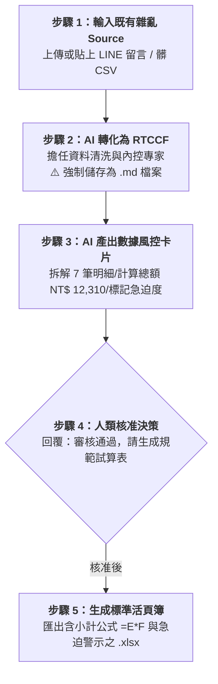

# 實戰階段二：既有 Source 轉化——非結構資料清洗建範例（Excel）

> 🟢 **適用代理平台**：Claude.ai / ChatGPT / Gemini / Google Antigravity  
> 🛠️ **建議執行模式**：**上傳或貼上雜亂 Source ➔ RTCCF 清洗規範化（強制儲存為 `.md`）➔ 數據風控審核卡片 ➔ 匯出標準 Excel 活頁簿**

---

## 🎯 階段定位與學習目標

在職場日常中，我們極少拿到乾淨齊全的資料，更多的是**「半成品或一堆髒資料 Source」**：
- 部門同仁在通訊軟體（LINE / Slack）裡七嘴八舌的文字留言。
- 業務員隨手記錄在記事本裡的客戶拜訪報價草稿。
- 系統匯出格式錯亂、單價混雜「元」或「NT$」導致無法加總的髒 CSV 檔案。

本階段的核心能力在於**「資料脫水、除錯、自動補齊公式與規格化建表」**：
- **拆分複合記錄**：將「買咖啡豆跟濾紙」一則留言自動拆解為兩列獨立數據。
- **純數值萃取與標準化**：過濾「2台」、「850元」，只保留純數字以支援 `=SUM()` 與 `=單價*數量`。
- **人機數據風控檢核**：在輸出 Excel 前，先產出「數據風控審核卡片」比對金額與筆數，確保零失誤。

---

## 🏆 案例情境與業務痛點

行政採購負責人王心怡每週都要在公司群組面對各部門主管零碎的採購申請：
- **痛點 1（格式極度混亂）**：有人寫單價、有人只寫總價；數量有人寫「2個」、有人寫「3盒」；日期有人寫「4/8」、有人寫「下週二」，完全無法直接複製到表格中。
- **痛點 2（人工計算易算錯退件）**：多品項留言容易漏乘小計，或是加總時算錯被財務部主管退回。
- **痛點 3（急迫度無警示）**：IT 處伺服器故障急需網路線，混在常態咖啡豆採購中，導致採購順序顛倒引發營運風險。

---

## 📥 學員實戰素材（多格式偽 Source File）

本階段隨附 **3 種實體偽資料格式**，學員可依習慣直接複製文字或以附件形式上傳：

| 偽 Source 素材檔案 | 檔案格式 | 適用練習方式 |
| :--- | :---: | :--- |
| 📄 [**素材_各部門零星採購需求未整理文字.txt**](./素材_各部門零星採購需求未整理文字.txt) | 純文字檔 | 模擬 LINE / Slack 群組對話串，直接複製貼入 AI 對話框。 |
| 📈 [**素材_各部門採購申請原始髒資料.csv**](./素材_各部門採購申請原始髒資料.csv) | CSV 數據表 | 模擬系統導出之髒資料（夾帶符號與空值），直接拖曳上傳 AI。 |
| 📊 [**素材_各部門零碎採購申請與報價單據.xlsx**](./素材_各部門零碎採購申請與報價單據.xlsx) | Excel 檔 | 模擬未排版、無公式之原始表格，供 AI 讀取並重新架構。 |

---

## ⚡ 人機協商工作流程（Human-in-the-Loop）

---

## 📖 核心章節提示詞導覽（點擊查看並一鍵複製）

- **[步驟 1：2-1_白話自然語言發想提示詞.md](./2-1_白話自然語言發想提示詞.md)**  
  提供將通訊軟體留言或未整理資料交給 AI 之自然語言發想提示詞。
- **[步驟 2：2-2_AI產出之RTCCF數據清洗與規範化提示詞.md](./2-2_AI產出之RTCCF數據清洗與規範化提示詞.md)**  
  AI 轉化出之專業 RTCCF 清洗提示詞，**必須儲存為 `.md` 檔案**。
- **[步驟 3 & 4：2-3_數據風控審核卡片與正規Excel匯出提示詞.md](./2-3_數據風控審核卡片與正規Excel匯出提示詞.md)**  
  數據風控審核卡片範本、核准指令與四大平台匯出指引。

---

## 📦 核心交付成果

- 📗 [**`各部門採購需求規範審核表_已完成.xlsx`**](./各部門採購需求規範審核表_已完成.xlsx)  
  *(由 AI 完成清洗與排版之標準活頁簿，具備純數值欄位、動態小計公式 `=E*F`、底部合計 `=SUM()` 以及急迫度淺紅高亮警示)*

---

[← 返回 Excel試算表生成模組導覽](../README.md)
