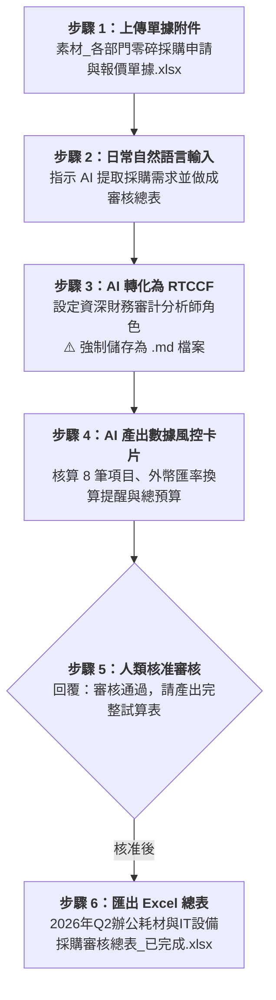

# 實戰範例 03：跨部門採購單據與報價清洗（Excel）

> 🟢 **適用代理平台**：Claude.ai / ChatGPT / Gemini / Google Antigravity  
> 🛠️ **建議執行模式**：**軌道二：素材 Grounding 協作軌**（上傳跨部門單據附件 ➔ 自然語言提需求 ➔ 轉 RTCCF 存為 `.md` ➔ 數據風控審核卡片 ➔ 匯出 Excel 預算總表）

---

## 📥 學員實戰素材與交付成品

- **必載輸入素材**：
  - [**`素材_各部門零碎採購申請與報價單據.xlsx`**](./素材_各部門零碎採購申請與報價單據.xlsx) *(多部門 Q2 採購申請與報價明細)*
  - 輔助格式：[**`素材_各部門採購需求原始清單.csv`**](./素材_各部門採購需求原始清單.csv) ｜ [**`素材_各部門零碎採購申請與報價單據.txt`**](./素材_各部門零碎採購申請與報價單據.txt)
- **核心交付成品**：
  - [**`2026年Q2辦公耗材與IT設備採購審核總表_已完成.xlsx`**](./2026年Q2辦公耗材與IT設備採購審核總表_已完成.xlsx) *(由 AI 跨來源清洗比對、外幣自動換算、含動態小計之完整企業預算審核活頁簿)*

---

## 🏆 案例情境與業務痛點

季末各部門提報採購預算時，總務與財務常面臨：
1. **多個部門格式各異**：有的給 Excel、有的給 CSV、有的直接給報價單文字截圖。
2. **幣別混雜與計算失誤**：IT 部門常報美金（USD），若未及時換算，匯總加總時會嚴重失真。
3. **缺乏客觀 Grounding**：人工謄寫容易漏筆或輸入錯誤金額，導致財務預算超支。

---

## ⚡ 人機協商工作流程（Human-in-the-Loop）

---

## 📖 核心章節導覽

- **[步驟 1：3-1_白話自然語言發想提示詞.md](./3-1_白話自然語言發想提示詞.md)**  
  上傳單據後，輸入白話清洗指令。
- **[步驟 2：3-2_AI產出之RTCCF單據清洗提示詞.md](./3-2_AI產出之RTCCF單據清洗提示詞.md)**  
  AI 生成之標準 RTCCF 單據清洗提示詞，**必須儲存為 `.md` 檔案**。
- **[步驟 3 & 4：3-3_數據風控審核卡片與採購總表匯出提示詞.md](./3-3_數據風控審核卡片與採購總表匯出提示詞.md)**  
  數據審核卡片範本、核准指令與匯出 Excel 操作說明。

---

[← 返回 Excel試算表生成模組](../README.md)
