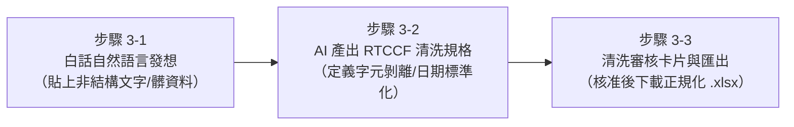

# 🟠 階梯三：髒資料清洗與轉化（告別無止境複製貼上）
## 🎯 從非結構文字與髒 CSV 到正規化資料庫：採購審核表實戰

> **核心學習定位**：  
> 真實世界中的資料往往殘缺不全：LINE 群組裡的條列文字、Email 雜亂內容、或是夾帶「台/包/盒/元」的髒 CSV。  
> 過去手動整理要用到艱深的 `TRIM`、`SUBSTITUTE`、`MID` 或「資料剖析」，甚至被迫手動一行行複製貼上到深夜。  
> **現在，你只要將非結構資料整段丟給 AI，搭配標準清洗原則，AI 30 秒自動剝離符號雜訊、校正日期，轉化為具備動態公式的乾淨試算表！**

---

## ⚡ 學員有感痛點對比表（手動 vs. AI 協作）

| 檢驗維度 | 傳統手動痛點（以前好痛苦 😭） | AI 協作新體驗（現在好輕鬆 ✨） |
| :--- | :--- | :--- |
| **文字資料轉表格** | 收到主管或客戶在 LINE 丟來的 20 筆需求，只能一格格複製、貼上、切換視窗，枯燥且容易漏字。 | 直接把整段文字貼入 AI，AI 自動用語意辨識解析欄位，生成整齊二維表格。 |
| **夾帶文字單位** | 遇到「`15 包`」、「`3,500 元`」，Excel 無法運算，手動尋找取代又常常改壞其他文字。 | AI 自動辨識並剝除文字單位，轉為純整數並套用千分位格式，保留資料純淨度。 |
| **日期格式混亂** | 遇到民國年（115/4/10）、斜線、中文月日混雜，Excel 無法排序與篩選日期。 | AI 自動將所有日期標準化為國際 ISO-8601（`YYYY-MM-DD`）。 |
| **資料補全與編碼** | 手動編單號（PR-001...）要自己往下拉，常常漏掉審核狀態欄位。 | AI 自動補齊標準化流水單號與預設審核狀態欄位。 |

---

## 🧭 實戰教學步驟（人機協作三步閉環）

1. **[步驟 3-1：白話自然語言發想提示詞](./3-1_白話自然語言發想提示詞.md)**  
   - 零門檻輸入！將雜亂文字與髒 CSV 需求口語化交給 AI。
2. **[步驟 3-2：AI 產出之 RTCCF 資料清洗與規範化提示詞](./3-2_AI產出之RTCCF資料清洗與規範化提示詞.md)**  
   - AI 嚴謹定義 Sanitization 規範、數值還原與 ISO-8601 日期標準。
3. **[步驟 3-3：數據清洗審核卡片與正規 Excel 匯出提示詞](./3-3_數據清洗審核卡片與正規Excel匯出提示詞.md)**  
   - 透過前後對比卡片驗收清洗成效，核准後匯出標準活頁簿。

---

## 📂 本單元隨附教材與實戰檔案

- 📄 **口語留言文字檔**：[素材_各部門零星採購需求未整理文字.txt](./素材_各部門零星採購需求未整理文字.txt)
- 📈 **夾帶符號髒 CSV**：[素材_各部門採購申請原始髒資料.csv](./素材_各部門採購申請原始髒資料.csv)
- 📊 **未排版舊單據**：[素材_各部門零碎採購申請與報價單據.xlsx](./素材_各部門零碎採購申請與報價單據.xlsx)
- 📗 **標準交付成果**：[`各部門採購需求規範審核表_已完成.xlsx`](./各部門採購需求規範審核表_已完成.xlsx)

---

[← 返回 Excel 全能實戰課程總導覽](../README.md)
