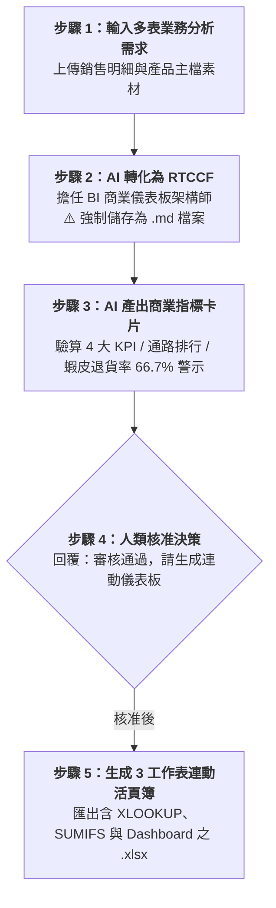

# 實戰階段三：綜合應用——多表關聯與商業分析儀表板（Excel）

> 🟢 **適用代理平台**：Claude.ai / ChatGPT / Gemini / Google Antigravity  
> 🛠️ **建議執行模式**：**多維度數據需求 ➔ RTCCF 跨表架構（強制儲存為 `.md`）➔ 商業指標風控審核卡片 ➔ 匯出多工作表連動儀表板**

---

## 🎯 階段定位與學習目標

在企業實務中，單一張扁平表格無法滿足高階決策需求。高階主管（總經理、營運協理）在經營會議上**絕不想看幾千行的原始流水帳**，而是需要：
1. **多工作表動態關聯**：將「銷售流水明細」、「產品主檔規格」與「退貨紀錄」拆分管理，透過 `=XLOOKUP()` / `=VLOOKUP()` 跨表自動查找成本與毛利。
2. **多條件加總分析**：運用 `=SUMIFS()` 與 `=COUNTIFS()` 自動依銷售通路（官網、實體門市、電商平台）計算各通路營收、毛利貢獻與退貨次數。
3. **C-Level 高階決策儀表板 (Dashboard)**：在第一頁呈現 4 大核心 KPI 資訊卡（總營收、總毛利、全體毛利率、退貨率）與排行警示，提供具備商業洞察的決策試算表。

---

## 🏆 案例情境與業務痛點

營運協理陳志豪要在季末董事會匯報「2026 年第一季全通路營運與獲利分析」，涵蓋 5 大通路（官網、台北信義門市、台中旗艦門市、Momo、蝦皮）：
- **痛點 1（跨表查找費時易錯）**：過去同仁用人工手動將產品成本填入每一筆銷售紀錄，只要主檔進貨成本調整，整份明細就要手動重算，極易出錯。
- **痛點 2（缺乏高階摘要視角）**：把幾十行的交易細目直接印給主管，主管看不到「哪一個通路賺最多？」、「哪一個通路退貨最嚴重？」。
- **痛點 3（異常缺乏預警機制）**：蝦皮商城退貨率高達 66.7%，若無自動公式與醒目標記，經營團隊將持續虧損物流與包裝成本。

---

## 📥 學員實戰素材（多維度偽 Source File）

本階段提供 **3 份多維度業務數據素材**，供學員模擬企業真實的跨表串聯與分析：

| 偽 Source 素材檔案 | 檔案格式 | 適用練習方式 |
| :--- | :---: | :--- |
| 📈 [**素材_2026第一季全通路銷售明細數據.csv**](./素材_2026第一季全通路銷售明細數據.csv) | CSV 數據表 | 20 筆真實銷售紀錄（含訂單編號、通路、SKU、數量、退貨狀態）。 |
| 🏷️ [**素材_產品規格定價與成本主檔.csv**](./素材_產品規格定價與成本主檔.csv) | CSV 數據表 | 產品基本主檔（SKU、品名、建議售價、進貨成本、安全毛利率）。 |
| 📊 [**素材_2026多通路營運分析原始資料.xlsx**](./素材_2026多通路營運分析原始資料.xlsx) | Excel 檔 | 內建「原始銷售記錄」與「產品主檔」多分頁之未關聯原始檔。 |

---

## ⚡ 人機協商工作流程（Human-in-the-Loop）

---

## 📖 核心章節提示詞導覽（點擊查看並一鍵複製）

- **[步驟 1：3-1_白話自然語言發想提示詞.md](./3-1_白話自然語言發想提示詞.md)**  
  提供初學者向 AI 提出多工作表串聯與主管 Dashboard 之自然語言發想提示詞。
- **[步驟 2：3-2_AI產出之RTCCF跨表串聯與儀表板架構提示詞.md](./3-2_AI產出之RTCCF跨表串聯與儀表板架構提示詞.md)**  
  AI 轉化出之專業 RTCCF 跨表提示詞，**必須儲存為 `.md` 檔案**。
- **[步驟 3 & 4：3-3_商業指標審核卡片與動態儀表板匯出提示詞.md](./3-3_商業指標審核卡片與動態儀表板匯出提示詞.md)**  
  商業指標風控卡片範本、核准指令與四大平台匯出指引。

---

## 📦 核心交付成果

- 📗 [**`2026全通路營運績效與銷售分析儀表板_已完成.xlsx`**](./2026全通路營運績效與銷售分析儀表板_已完成.xlsx)  
  *(由 AI 生成之高階商務活頁簿，內建 3 個動態連動工作表：`KPI_營運分析儀表板`、`銷售流水明細`、`產品規格主檔`；具備 `=XLOOKUP()`、`=SUMIFS()`、`=COUNTIFS()` 與主管 KPI 資訊方塊)*

---

[← 返回 Excel試算表生成模組導覽](../README.md)
