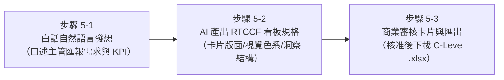

# 🟣 階梯五：商業儀表板與視覺化（直上主管級商務看板）
## 🎯 從呆板數字到 C-Level 經營決策看板：Executive Dashboard

> **核心學習定位**：  
> 這是 Excel 辦公室應用的終極殿堂！面對董事長、總經理與跨部門副總，主管不想看到一格格密密麻麻的數字，而是需要能在 10 秒內掌握全局的**商業儀表板（Dashboard）**。  
> 過去手動做圖表，往往配色突兀、只會做單一長條圖、不懂 KPI 卡片佈局，甚至做完圖表不知如何總結經營觀點。  
> **現在，你只要告訴 AI 匯報層級與關鍵指標，AI 瞬間為你規劃麥肯錫等級的沉穩配色、4 大核心 KPI 卡片，並直接為你寫出「3 大亮點表現與 2 大風控建議」的完整高階報告！**

---

## ⚡ 學員有感痛點對比表（手動 vs. AI 協作）

| 檢驗維度 | 傳統手動痛點（以前好痛苦 😭） | AI 協作新體驗（現在好輕鬆 ✨） |
| :--- | :--- | :--- |
| **圖表設計水準** | 直接按「插入圖表」，配色刺眼（紅配綠）、座標軸擠成一團，被主管批評「看不懂重點」。 | AI 指導專業商務色系（沉穩深藍、科技灰），規劃乾淨專業的視覺層次。 |
| **KPI 摘要卡片** | 不知道如何在 Excel 設計大字號、獨立方塊的頂部指標卡片，只能自己慢慢調儲存格邊框。 | AI 一鍵規劃 **4 大核心 KPI 摘要卡片**（營收、毛利、毛利率、訂單數），動態公式取值。 |
| **多維度視覺化** | 不懂雙軸圖（長條圖看營收 + 折線圖看毛利率），每次圖表做出來兩條線貼在底層看不清。 | AI 精準匹配最適圖表類型，並提供完整的版面佈局配置與圖表生成指南。 |
| **商業洞察輸出** | 做完圖表腦袋一片空白，老闆問「所以這張圖代表什麼？」，答不出商業洞察。 | AI 直接自動生成「3 大業績亮點與 2 大風險警示」，可直接當作簡報逐字稿！ |

---

## 🧭 實戰教學步驟（人機協作三步閉環）

1. **[步驟 5-1：白話自然語言發想提示詞](./5-1_白話自然語言發想提示詞.md)**  
   - 零門檻輸入！將匯報對象、關鍵 KPI、圖表期望口語化告訴 AI。
2. **[步驟 5-2：AI 產出之 RTCCF 高階儀表板架構提示詞](./5-2_AI產出之RTCCF高階儀表板架構提示詞.md)**  
   - AI 嚴謹定義三層式架構（視覺層 ➔ 彙總層 ➔ 明細層）與專業商務色系。
3. **[步驟 5-3：商業指標審核卡片與動態儀表板匯出提示詞](./5-3_商業指標審核卡片與動態儀表板匯出提示詞.md)**  
   - 預檢 4 大 KPI 驗算結果與高階洞察摘要，核准後匯出實體活頁簿。

---

## 📂 本單元隨附教材與實戰檔案

- 📈 **全通路銷售明細數據**：[素材_2026第一季全通路銷售明細數據.csv](./素材_2026第一季全通路銷售明細數據.csv)
- 🏷️ **產品規格定價主檔**：[素材_產品規格定價與成本主檔.csv](./素材_產品規格定價與成本主檔.csv)
- 📊 **營運原始資料**：[素材_2026多通路營運分析原始資料.xlsx](./素材_2026多通路營運分析原始資料.xlsx)
- 📗 **標準交付成果**：[`2026全通路營運績效與銷售分析儀表板_已完成.xlsx`](./2026全通路營運績效與銷售分析儀表板_已完成.xlsx)
  - 內含：高階營運分析儀表板、4 大 KPI 卡片、通路績效排行圖表、經營洞察文字報告。

---

[← 返回 Excel 全能實戰課程總導覽](../README.md)
