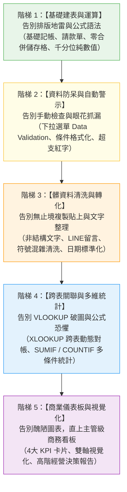

# 📊 Excel (.xlsx) 試算表生成模組：五階漸進實戰指南
## 🚀 像學 Excel 一樣由淺入深：從「痛恨公式」到「指揮 AI 打造專業試算表」

> **模組核心教育哲學**：  
> 過去手動做一個標準的 Excel，學生必須背負沈重的觀念包袱——從避免合併儲存格、記憶複雜的公式語法（SUM/AVERAGE、IF 巢狀、VLOOKUP 鎖定 `$`）、到痛苦的髒資料清洗與圖表配色。很多學員學了幾週，依然做不出能交付主管的漂亮報表。  
> **在 AI 時代，學習路徑被徹底顛覆！學生只要懂一點點 Excel 的基礎概念，就能透過口語引導 AI 成為你的專屬試算表架構師。**  
> 本課程就像教 Excel 一樣，由淺入深設計了**「五大進階階梯」**，每一階都具備鮮明的【手動痛苦 vs. AI 賦能】強烈對比，讓學員每一堂課都「超級有感」！

---

## 🧭 人機協作標準工作流（Human-in-the-Loop 四步閉環）

---

## 🗺️ Excel 五大漸進實戰能力地圖

---

## ⚡ 五大階梯教學全覽表

| 實戰階梯 | 核心概念與技能 | 傳統手動痛點（以前好痛苦 😭） | AI 協作體驗（現在超有感 ✨） | 核心交付成果 (.xlsx) |
| :--- | :--- | :--- | :--- | :--- |
| **[🟢 階梯一：基礎建表與運算](./01_階梯一_基礎建表與運算_告別排版地雷與公式語法/README.md)** | **標準資料庫結構、純數值千分位、基礎公式** | 亂合併儲存格導致無法篩選；金額手打「元」導致 SUM 算不出來；小計打死值。 | 只要口述欄位需求，AI 自動規劃禁止合併的二維表格、純整數千分位格式與動態相乘/相加公式。 | 📗 [`部門差旅與專案費用報銷表_已完成.xlsx`](./01_階梯一_基礎建表與運算_告別排版地雷與公式語法/部門差旅與專案費用報銷表_已完成.xlsx) |
| **[🟡 階梯二：資料防呆與自動警示](./02_階梯二_資料防呆與自動警示_告別手動檢查與眼花抓漏/README.md)** | **資料驗證 (下拉選單)、條件式格式化、超支紅綠燈** | 同事狀態亂填無法統計；條件式格式層級深、鎖定欄位 `$A1` 容易搞錯；主管用肉眼找超支。 | 只要口述管理規則，AI 一鍵配置下拉選單與超支紅字、延遲黃底、完成綠底之條件格式化規則。 | 📗 [`專案里程碑與預算進度管控表_已完成.xlsx`](./02_階梯二_資料防呆與自動警示_告別手動檢查與眼花抓漏/專案里程碑與預算進度管控表_已完成.xlsx) |
| **[🟠 階梯三：髒資料清洗與轉化](./03_階梯三_髒資料清洗與轉化_告別無止境複製貼上/README.md)** | **非結構文字抽取、字元雜訊剝除、日期正規化** | LINE/Email 留言一行行手動複製貼上；舊 CSV 數字夾雜「台/包/元」無法加總；民國年混雜。 | 整段文字餵給 AI，語意自動拆解欄位，剝除文字單位保留純數值，日期統一校正為 YYYY-MM-DD。 | 📗 [`各部門採購需求規範審核表_已完成.xlsx`](./03_階梯三_髒資料清洗與轉化_告別無止境複製貼上/各部門採購需求規範審核表_已完成.xlsx) |
| **[🔵 階梯四：跨表關聯與多維統計](./04_階梯四_跨表關聯與多維統計_告別VLOOKUP破圖與公式恐懼/README.md)** | **現代化 XLOOKUP 檢索、COUNTIF、SUMIF 統計矩陣** | VLOOKUP 只能向右查、增刪欄位公式全爆、找不到報錯 `#N/A`；多條件統計參數老是記錯。 | 只要說明主檔與明細表關係，AI 自動撰寫強大穩健的 XLOOKUP，並自動架構多維度統計匯總表。 | 📗 [`2026多通路銷售毛利與跨表統計分析表_已完成.xlsx`](./04_階梯四_跨表關聯與多維統計_告別VLOOKUP破圖與公式恐懼/2026多通路銷售毛利與跨表統計分析表_已完成.xlsx) |
| **[🟣 階梯五：商業儀表板與視覺化](./05_階梯五_商業儀表板與視覺化_直上主管級商務看板/README.md)** | **C-Level Executive Dashboard、4 大 KPI 卡片、高階洞察** | 插入圖表配色刺眼被主管罵；雙軸圖調不好；做完圖表答不出「這張圖代表什麼商業洞察」。 | 一句話生成麥肯錫等級沉穩色系儀表板、4 大 KPI 獨立卡片，AI 直接寫好「3大亮點與2大風控」講稿！ | 📗 [`2026全通路營運績效與銷售分析儀表板_已完成.xlsx`](./05_階梯五_商業儀表板與視覺化_直上主管級商務看板/2026全通路營運績效與銷售分析儀表板_已完成.xlsx) |

---

## 📂 五大階梯目錄與檔案速查

### 🟢 [01. 階梯一：基礎建表與運算（告別排版地雷與公式語法）](./01_階梯一_基礎建表與運算_告別排版地雷與公式語法/README.md)
- **步驟 1-1**：[1-1_白話自然語言發想提示詞.md](./01_階梯一_基礎建表與運算_告別排版地雷與公式語法/1-1_白話自然語言發想提示詞.md) —— 初學者白話報銷需求
- **步驟 1-2**：[1-2_AI產出之RTCCF標準建表提示詞.md](./01_階梯一_基礎建表與運算_告別排版地雷與公式語法/1-2_AI產出之RTCCF標準建表提示詞.md) —— 標準二維結構與純數值定義
- **步驟 1-3**：[1-3_架構審核卡片與Excel範本生成提示詞.md](./01_階梯一_基礎建表與運算_告別排版地雷與公式語法/1-3_架構審核卡片與Excel範本生成提示詞.md) —— 預檢卡片與檔案匯出
- **交付檔案**：📗 [`部門差旅與專案費用報銷表_已完成.xlsx`](./01_階梯一_基礎建表與運算_告別排版地雷與公式語法/部門差旅與專案費用報銷表_已完成.xlsx)

### 🟡 [02. 階梯二：資料防呆與自動警示（告別手動檢查與眼花抓漏）](./02_階梯二_資料防呆與自動警示_告別手動檢查與眼花抓漏/README.md)
- **步驟 2-1**：[2-1_白話自然語言發想提示詞.md](./02_階梯二_資料防呆與自動警示_告別手動檢查與眼花抓漏/2-1_白話自然語言發想提示詞.md) —— 專案進度管理與防呆口述
- **步驟 2-2**：[2-2_AI產出之RTCCF防呆與警示提示詞.md](./02_階梯二_資料防呆與自動警示_告別手動檢查與眼花抓漏/2-2_AI產出之RTCCF防呆與警示提示詞.md) —— Data Validation 與條件式格式色階
- **步驟 2-3**：[2-3_防呆審核卡片與Excel範本生成提示詞.md](./02_階梯二_資料防呆與自動警示_告別手動檢查與眼花抓漏/2-3_防呆審核卡片與Excel範本生成提示詞.md) —— 防呆卡片預檢與匯出
- **交付檔案**：📗 [`專案里程碑與預算進度管控表_已完成.xlsx`](./02_階梯二_資料防呆與自動警示_告別手動檢查與眼花抓漏/專案里程碑與預算進度管控表_已完成.xlsx)

### 🟠 [03. 階梯三：髒資料清洗與轉化（告別無止境複製貼上）](./03_階梯三_髒資料清洗與轉化_告別無止境複製貼上/README.md)
- **步驟 3-1**：[3-1_白話自然語言發想提示詞.md](./03_階梯三_髒資料清洗與轉化_告別無止境複製貼上/3-1_白話自然語言發想提示詞.md) —— LINE 雜亂文字與髒 CSV 清洗發想
- **步驟 3-2**：[3-2_AI產出之RTCCF資料清洗與規範化提示詞.md](./03_階梯三_髒資料清洗與轉化_告別無止境複製貼上/3-2_AI產出之RTCCF資料清洗與規範化提示詞.md) —— 剝除文字單位與日期標準化
- **步驟 3-3**：[3-3_數據清洗審核卡片與正規Excel匯出提示詞.md](./03_階梯三_髒資料清洗與轉化_告別無止境複製貼上/3-3_數據清洗審核卡片與正規Excel匯出提示詞.md) —— 前後對比卡片核對與匯出
- **交付檔案**：📗 [`各部門採購需求規範審核表_已完成.xlsx`](./03_階梯三_髒資料清洗與轉化_告別無止境複製貼上/各部門採購需求規範審核表_已完成.xlsx)

### 🔵 [04. 階梯四：跨表關聯與多維統計（告別 VLOOKUP 破圖與公式恐懼）](./04_階梯四_跨表關聯與多維統計_告別VLOOKUP破圖與公式恐懼/README.md)
- **步驟 4-1**：[4-1_白話自然語言發想提示詞.md](./04_階梯四_跨表關聯與多維統計_告別VLOOKUP破圖與公式恐懼/4-1_白話自然語言發想提示詞.md) —— 產品主檔與訂單明細關聯發想
- **步驟 4-2**：[4-2_AI產出之RTCCF跨表串聯與統計提示詞.md](./04_階梯四_跨表關聯與多維統計_告別VLOOKUP破圖與公式恐懼/4-2_AI產出之RTCCF跨表串聯與統計提示詞.md) —— XLOOKUP 動態取值與 SUMIF 匯總
- **步驟 4-3**：[4-3_跨表關聯審核卡片與Excel範本生成提示詞.md](./04_階梯四_跨表關聯與多維統計_告別VLOOKUP破圖與公式恐懼/4-3_跨表關聯審核卡片與Excel範本生成提示詞.md) —— 抽樣驗算與三表聯動匯出
- **交付檔案**：📗 [`2026多通路銷售毛利與跨表統計分析表_已完成.xlsx`](./04_階梯四_跨表關聯與多維統計_告別VLOOKUP破圖與公式恐懼/2026多通路銷售毛利與跨表統計分析表_已完成.xlsx)

### 🟣 [05. 階梯五：商業儀表板與視覺化（直上主管級商務看板）](./05_階梯五_商業儀表板與視覺化_直上主管級商務看板/README.md)
- **步驟 5-1**：[5-1_白話自然語言發想提示詞.md](./05_階梯五_商業儀表板與視覺化_直上主管級商務看板/5-1_白話自然語言發想提示詞.md) —— 高階匯報需求與 KPI 發想
- **步驟 5-2**：[5-2_AI產出之RTCCF高階儀表板架構提示詞.md](./05_階梯五_商業儀表板與視覺化_直上主管級商務看板/5-2_AI產出之RTCCF高階儀表板架構提示詞.md) —— 麥肯錫色系、4 大 KPI 卡片與圖表佈局
- **步驟 5-3**：[5-3_商業指標審核卡片與動態儀表板匯出提示詞.md](./05_階梯五_商業儀表板與視覺化_直上主管級商務看板/5-3_商業指標審核卡片與動態儀表板匯出提示詞.md) —— KPI 驗算卡片與經營洞察匯出
- **交付檔案**：📗 [`2026全通路營運績效與銷售分析儀表板_已完成.xlsx`](./05_階梯五_商業儀表板與視覺化_直上主管級商務看板/2026全通路營運績效與銷售分析儀表板_已完成.xlsx)

---

## 💡 Excel 試算表專業防坑四大鐵律（Pro Tips）

1. **嚴禁合併儲存格（No Merged Cells in Data Rows）**：
   - 資料列合併是 Excel 許多功能的殺手（無法排序、無法篩選、樞紐分析破圖）。透過 AI 規範每列獨立一筆記錄。
2. **純數值原則（Pure Numeric Values Only）**：
   - 金額欄位絕對不填入 `$`、`NT$`、`元`、`包`。貨幣與計量符號透過儲存格格式 `#,##0` 達成，保持運算彈性。
3. **跨表檢索首選 XLOOKUP（XLOOKUP > VLOOKUP）**：
   - 告別 VLOOKUP 的欄號限制與增刪欄位破壞，全面擁抱 XLOOKUP。
4. **零硬編碼計算（Formulas First）**：
   - 凡是小計、總計、差異、毛利率，一律使用公式動態運算，禁止填入靜態算好的死值。

---

[← 返回辦公室全能應用導覽總表](../README.md)
