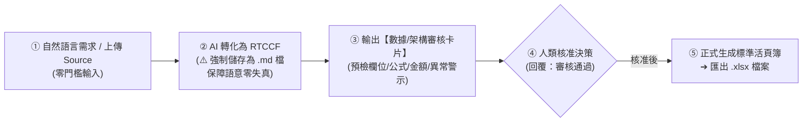

# Excel (.xlsx) 試算表生成模組：三階段進階實戰指南
## 🚀 跨平台 AI 試算表全能架構（Claude × ChatGPT × Gemini × Antigravity）

> **模組核心定位**：在現代辦公室與商務環境中，**Excel 是 Office 系列中實用價值最高、影響力最大的核心工具**。  
> 無論是專案管理、採購核銷、成本管控、還是高階經營決策，數據力就是職場影響力。  
> 本專題專門針對非技術人員設計，不教死記硬背函數，而是透過**「三大漸進階段」**帶領學員掌握從「概念發想」到「髒資料清洗」再到「多表商業儀表板」的 AI 協作全流程！

---

## 🧭 人機協作標準工作流（Human-in-the-Loop 四步閉環）

---

## 🗺️ Excel 三大實戰進階學習地圖

本教學模組將 Excel 的 AI 應用劃分為三大循序漸進的實戰階段。每個階段皆配備**真實商務情境、現成偽 Source File、方便一鍵複製的 Prompt 檔案、以及已完成的標準 Excel 交付成果**：

| 實戰階段 | 核心學習主軸 | 核心商務情境（Scenario） | 隨附偽 Source File | 核心交付成果 (.xlsx) |
| :--- | :--- | :--- | :--- | :--- |
| **[階段一：無中生有](./01_階段一_無中生有_從零規格生成標準試算表/README.md)** | **從零發想與規格化** 手邊無現成表格，依主管口語或網路概念建立公版範本 | 專案經理接下「2026 數位轉型跨部門專案」，需從零設計時程、預算與超支警示公版 | 📝 [需求規格草案.md](./01_階段一_無中生有_從零規格生成標準試算表/素材_專案預算與進度管理需求規格草案.md) 📄 [需求規格草案.txt](./01_階段一_無中生有_從零規格生成標準試算表/素材_專案預算與進度管理需求規格草案.txt) | 📗 [`專案里程碑與預算進度管控表_已完成.xlsx`](./01_階段一_無中生有_從零規格生成標準試算表/專案里程碑與預算進度管控表_已完成.xlsx) |
| **[階段二：既有 Source 轉化](./02_階段二_既有Source轉化_非結構資料清洗建範例/README.md)** | **非結構化髒資料清洗** 已有零散資料，透過 AI 清洗、拔除文字符號、補齊公式 | 採購人員收到 LINE 群組七嘴八舌的留言、未排版單據與夾帶符號的髒 CSV | 📄 [零星採購文字.txt](./02_階段二_既有Source轉化_非結構資料清洗建範例/素材_各部門零星採購需求未整理文字.txt) 📈 [原始髒資料.csv](./02_階段二_既有Source轉化_非結構資料清洗建範例/素材_各部門採購申請原始髒資料.csv) 📊 [原始單據.xlsx](./02_階段二_既有Source轉化_非結構資料清洗建範例/素材_各部門零碎採購申請與報價單據.xlsx) | 📗 [`各部門採購需求規範審核表_已完成.xlsx`](./02_階段二_既有Source轉化_非結構資料清洗建範例/各部門採購需求規範審核表_已完成.xlsx) |
| **[階段三：綜合應用](./03_階段三_綜合應用_多表關聯與業務分析儀表板/README.md)** | **多表連動與商業儀表板** 跨工作表 XLOOKUP 檢索、SUMIFS 多條件統計、C-Level KPI Dashboard | 營運協理季末向董事長匯報全通路營收、各通路毛利貢獻排行與異常退貨率警示 | 📈 [全通路銷售數據.csv](./03_階段三_綜合應用_多表關聯與業務分析儀表板/素材_2026第一季全通路銷售明細數據.csv) 🏷️ [產品成本主檔.csv](./03_階段三_綜合應用_多表關聯與業務分析儀表板/素材_產品規格定價與成本主檔.csv) 📊 [多通路原始底表.xlsx](./03_階段三_綜合應用_多表關聯與業務分析儀表板/素材_2026多通路營運分析原始資料.xlsx) | 📗 [`2026全通路營運績效與銷售分析儀表板_已完成.xlsx`](./03_階段三_綜合應用_多表關聯與業務分析儀表板/2026全通路營運績效與銷售分析儀表板_已完成.xlsx) |

---

## 📂 三大階段次目錄速查

### 🟢 [01. 階段一：無中生有（從零規格生成標準試算表）](./01_階段一_無中生有_從零規格生成標準試算表/README.md)
- **步驟 1-1**：[1-1_白話自然語言發想提示詞.md](./01_階段一_無中生有_從零規格生成標準試算表/1-1_白話自然語言發想提示詞.md) —— 初學者口語發想
- **步驟 1-2**：[1-2_AI產出之RTCCF無中生有建表提示詞.md](./01_階段一_無中生有_從零規格生成標準試算表/1-2_AI產出之RTCCF無中生有建表提示詞.md) —— 專業建表架構（強制儲存為 `.md`）
- **步驟 1-3**：[1-3_架構審核卡片與Excel範本生成提示詞.md](./01_階段一_無中生有_從零規格生成標準試算表/1-3_架構審核卡片與Excel範本生成提示詞.md) —— 審核卡片核對與四大平台匯出指引

### 🟡 [02. 階段二：既有 Source 轉化（非結構資料清洗建範例）](./02_階段二_既有Source轉化_非結構資料清洗建範例/README.md)
- **步驟 2-1**：[2-1_白話自然語言發想提示詞.md](./02_階段二_既有Source轉化_非結構資料清洗建範例/2-1_白話自然語言發想提示詞.md) —— 髒資料來源發想
- **步驟 2-2**：[2-2_AI產出之RTCCF數據清洗與規範化提示詞.md](./02_階段二_既有Source轉化_非結構資料清洗建範例/2-2_AI產出之RTCCF數據清洗與規範化提示詞.md) —— 清洗與數值標準化（強制儲存為 `.md`）
- **步驟 2-3**：[2-3_數據風控審核卡片與正規Excel匯出提示詞.md](./02_階段二_既有Source轉化_非結構資料清洗建範例/2-3_數據風控審核卡片與正規Excel匯出提示詞.md) —— 數據風控核算與標準表格產出

### 🔴 [03. 階段三：綜合應用（多表關聯與業務分析儀表板）](./03_階段三_綜合應用_多表關聯與業務分析儀表板/README.md)
- **步驟 3-1**：[3-1_白話自然語言發想提示詞.md](./03_階段三_綜合應用_多表關聯與業務分析儀表板/3-1_白話自然語言發想提示詞.md) —— 多表關聯與決策指標發想
- **步驟 3-2**：[3-2_AI產出之RTCCF跨表串聯與儀表板架構提示詞.md](./03_階段三_綜合應用_多表關聯與業務分析儀表板/3-2_AI產出之RTCCF跨表串聯與儀表板架構提示詞.md) —— XLOOKUP 與 SUMIFS 架構（強制儲存為 `.md`）
- **步驟 3-3**：[3-3_商業指標審核卡片與動態儀表板匯出提示詞.md](./03_階段三_綜合應用_多表關聯與業務分析儀表板/3-3_商業指標審核卡片與動態儀表板匯出提示詞.md) —— 4 大 KPI 驗算卡片與多工作表匯出

---

## 💡 Excel 試算表防坑與風控守則（Pro Tips）

1. **純數值原則（No Currency Text）**：
   - 審核卡片階段嚴格確認金額欄位是否含有 `NT$`、`$`、`,`、`元` 或 `台/包/盒`。
   - 務必保持為純整數，設定儲存格數值格式為 `#,##0`，Excel 才能直接執行 `=SUM()` 或連動公式。
2. **零硬編碼原則（Formulas First）**：
   - 凡是小計（`單價*數量`）、預算差異（`預算-支出`）、毛利（`營收-成本`）與毛利率（`毛利/營收`），必須由 Excel 公式動態運算，禁止 AI 填寫靜態死值。
3. **跨表動態檢索（XLOOKUP > VLOOKUP）**：
   - 在多工作表場景中，優先要求 AI 撰寫 `=XLOOKUP()` 公式。其具備不依賴欄位順序、不怕增刪欄位、自帶未找到容錯之絕佳優勢。
4. **日期標準化（ISO-8601）**：
   - 統一要求 `YYYY-MM-DD` 格式，避免跨月或跨年度排序時出現混淆。

---

[← 返回辦公室全能應用導覽總表](../README.md)
