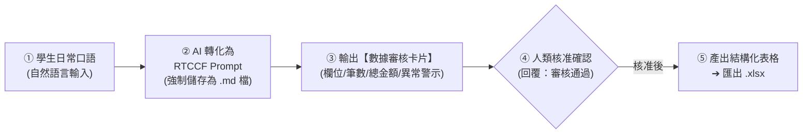

# Excel (.xlsx) 試算表生成模組
## 🚀 跨平台 AI 非結構化數據清洗與試算表一秒匯出（Claude × ChatGPT × Gemini × Antigravity）

> **模組目標**：非技術人員常需處理各部門在通訊軟體（LINE、Slack）中口頭交代、開會手寫白板或多份跨部門單據中的零散數據。本模組示範如何透過**「日常口語輸入 ➔ RTCCF 數據清洗（強制存為 `.md`）➔ 數據風控審核卡片（零幻覺人機檢核）➔ 匯出標準 Excel (.xlsx) 活頁簿」**，徹底擺脫手工心算與格式跑版。

---

## 🧭 人機協作標準工作流（Human-in-the-Loop）

---

## 📚 次資料夾實戰範例導覽

本模組收錄三大核心實戰範例，每個範例皆為獨立次資料夾，提供完整提示詞流程、素材與產出範本：

| 次範例主題 | 協作軌道 | 核心業務場景 | 核心交付成果 |
| :--- | :--- | :--- | :--- |
| **[01. 通訊軟體零碎採購需求清洗](./01_通訊軟體零碎採購需求清洗/README.md)** | **軌道一：Prompt 協作軌** | 洗淨 LINE 群組各部門雜亂口語採購文字，自動計算小計與總採購金額 | 📗 [`各部門零碎採購審核清單_已完成.xlsx`](./01_通訊軟體零碎採購需求清洗/各部門零碎採購審核清單_已完成.xlsx) |
| **[02. 會議白板照片OCR辨識轉待辦清單](./02_會議白板照片OCR辨識轉待辦清單/README.md)** | **多模態視覺 OCR 軌** | 拍照上傳實體會議手寫白板照片，AI 多模態辨識筆跡並產出 Excel 專案待辦表 | 📗 [`專案待辦事項進度表_已完成.xlsx`](./02_會議白板照片OCR辨識轉待辦清單/專案待辦事項進度表_已完成.xlsx) |
| **[03. 跨部門採購單據與報價清洗](./03_跨部門採購單據與報價清洗/README.md)** | **軌道二：素材 Grounding 軌** | 上傳多檔案跨月份單據附件（Excel/CSV/TXT），整合 IT 與耗材採購預算總表 | 📗 [`2026年Q2辦公耗材與IT設備採購審核總表_已完成.xlsx`](./03_跨部門採購單據與報價清洗/2026年Q2辦公耗材與IT設備採購審核總表_已完成.xlsx) |

---

## 💡 試算表避坑與風控技巧（Pro Tips）

1. **純數值要求**：在審核卡片階段特別留意金額欄位是否含有 `NT$`、`$`、`,` 或「元」。保持純數字，下載為 Excel 時才能直接以 `=SUM()` 自動加總。
2. **日期標準化**：統一要求 `YYYY-MM-DD` 格式，避免在 Excel 中排序時出現跨年份混亂。
3. **小數點處理**：外幣換算或含有稅額項目，在 Prompt 指定「四捨五入取至整數」，避免試算表欄位出現無限循環小數。

---

[← 返回辦公室全能應用導覽總表](../README.md)
