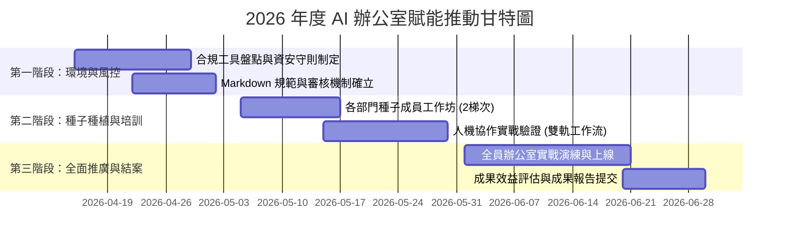

# 2026 年度辦公室 AI 賦能推動計畫書

**文件編號**：OP-2026-PLAN-001  
**受文者**：總經理室、各部門一級主管  
**擬訂單位**：營運管理部  
**實施對象**：全體非技術行政與商務同仁（共計 80 人）  
**發布日期**：2026 年 04 月 15 日  

---

## 壹、計畫緣起與背景現況分析

隨著生成式人工智慧（Generative AI）技術日益成熟，各產業已逐步將 AI 工具融入日常行政與營運流程。經本公司行政與營運團隊於 2026 年第一季之內部調查，非技術同仁（涵蓋行政總務、人資培訓、財務會計、業務助理等共 80 人）普遍面臨以下三大作業瓶頸：

1. **文書處理耗時漫長**：日常公文、會議紀錄、各類專案企劃草擬占據每位同仁每週約 12~16 小時之例行工時。
2. **數據整理容易錯漏**：來自 LINE、Email 等通訊管道之非結構化採購單據與請款需求，仰賴人工登打至 Excel，常有格式不一、加總公式出錯之隱憂。
3. **多媒體與視覺簡報門檻高**：業務對外提案簡報與對內宣導圖表缺乏專職設計人員支援，製作週期長且風格難以統一。

為此，推動跨主流 AI 平台（Claude.ai、ChatGPT、Gemini、Antigravity）之全面賦能計畫，讓同仁學會「人機協商」標準模式，已屬當務之急。

---

## 貳、推動目標與關鍵成果指標 (KPI)

本計畫旨在透過制度化規範與實戰培訓，達成以下三大核心量化指標：

| 指標向度 | 目標基準 (Baseline) | 計畫目標 (Target) | 驗證方式 |
| :--- | :--- | :--- | :--- |
| **行政工時節省** | 例行文書耗時每週 14 小時 | **節省 40% 工時**（每週降至 8.4 小時以內） | 雙週工時追蹤問卷與產出統計 |
| **交付格式覆蓋率** | 僅能由專人製作特定格式 | **90% 同仁具備 Word/Excel/PPT/圖表自主生成能力** | 課堂實作結業作品考核 |
| **資安與合規性** | 缺乏統一人機協同防護守則 | **達成 100% 機敏資料脫敏、零資安外洩違規** | 資訊安全稽核紀錄與稽核抽檢 |

---

## 參、推動實施階段與里程碑

本計畫採「三階段循序漸進」模式推動，期程共計 12 週：

1. **第一階段：法規防線與基礎建設（4 月中旬～4 月底）**
   - 確立 Claude、ChatGPT、Gemini、Antigravity 之合法授權與內部網絡調用規範。
   - 訂定強制「Markdown (.md) 儲存」與「人機協作審核卡片」雙閘門作業指引。
2. **第二階段：種子培訓與驗證（5 月上旬～5 月底）**
   - 自行政、人資、財務、業務選拔 16 位種子成員，參與 2 梯次實作工作坊。
   - 驗證 Word、Excel、PPT、資訊圖表之真實工作流與模板庫。
3. **第三階段：全員推廣與結案評估（6 月全月）**
   - 全體 80 位同仁正式導入日常應用，建立內部 Prompt 知識資產庫。

---

## 肆、資訊安全與個資去識別化防線

為落實資安合規，所有同仁在調用外部 AI 平台時，一律遵循**「查核、分流、負責」**三大安全鐵則：

1. **查核（Grounding Verification）**：禁止直接採信 AI 臆測之數據，特別是法規條文與財務金額，必須以企業內部上傳之官方文件為依據。
2. **分流（Data De-identification）**：上傳前必須對員工身分證字號、客戶信用卡號、商業機密價格進行去識別化處理（如改為 `[客戶A]`、`[員工01]`）。
3. **負責（Human-in-the-Loop）**：AI 僅為起草助理，最終文件發布前必須經過人工審核卡片覆核簽章，使用者需對交付成品承擔最終法律責任。

---

## 伍、資源預算配置

| 預算項目 | 項目說明 | 預估金額 (NTD) | 備註 |
| :--- | :--- | ---: | :--- |
| **軟體帳號授權** | 企業版 AI 工具團隊訂閱與 API 調用額度 | 0 | 優先整合現有企業授權與免費合規方案 |
| **教育訓練場地與耗材** | 2 梯次種子培訓工作坊實體場地與餐盒費用 | 15,000 | 總公司大會議室舉辦 |
| **講義編印與證書** | 實戰範例手冊與結訓認證文件 | 5,000 | 亦提供無紙化 PDF 成果手冊 |
| **不可預見雜支** | 備用技術諮詢與臨時耗材 | 5,000 | 實報實銷 |
| **總計預算** | - | **25,000** | 效益回報期預計小於 1 個月 |

---

## 陸、預期效益與投資報酬率 (ROI) 總結

以全體 80 位同仁平均時薪 NT$ 250 計算：
- 每週節省工時：80 人 × 5.6 小時 ＝ 448 小時 / 週。
- 每週創造產值效益：448 小時 × NT$ 250 ＝ NT$ 112,000。
- **單月即可創造超過 40 萬元新台幣之實質工時價值**，投資報酬率極為顯著。

懇請 總經理 裁示核可，俾便啟動後續培訓準備作業。

**呈核簽章**：  
擬辦人：______________　　覆核：______________　　核准：______________
