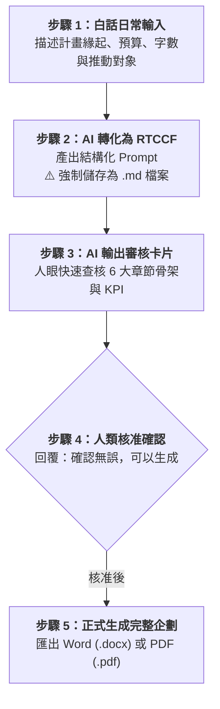

# 實戰範例 01：專案企劃書與推動計畫（Word / PDF）

> 🟢 **適用代理平台**：Claude.ai / ChatGPT / Gemini / Google Antigravity  
> 🛠️ **建議執行模式**：**軌道一：Prompt 協作軌**（自然語言發想 ➔ RTCCF 強制存為 `.md` ➔ 文件審核卡片 ➔ 正式生成 Word/PDF）

---

## 📥 學員實戰素材與交付成品

- **核心交付成品**：
  - [**`2026年度辦公室AI賦能推動計畫書_範本.md`**](./2026年度辦公室AI賦能推動計畫書_範本.md) *(由 AI 完整產出之 1,500 字標準公文格式企劃書，可一鍵轉為 Word (.docx) 或 PDF (.pdf))*

---

## 🏆 案例情境與業務痛點

企業非技術同仁在撰寫專案企劃書時，常面臨三大困擾：
1. **指令空泛，AI 產出不知所云**：直接告訴 AI「幫我寫企劃」，產出往往缺少推動對象、分階段時程與資安規範。
2. **缺乏審查機制，直接長篇大論**：AI 一口氣產生數千字，若方向偏差必須整篇重寫，浪費時間。
3. **沒有保存結構化提示詞**：沒有將 Prompt 儲存為 `.md` 檔案，下次換工具或微調時無法重複調用。

---

## ⚡ 人機協商工作流程（Human-in-the-Loop）

---

## 📖 核心章節導覽

- **[步驟 1：1-1_白話自然語言發想提示詞.md](./1-1_白話自然語言發想提示詞.md)**  
  學員日常口語需求輸入範例。
- **[步驟 2：1-2_AI產出之RTCCF專案計畫書提示詞.md](./1-2_AI產出之RTCCF專案計畫書提示詞.md)**  
  AI 改寫之標準 RTCCF 提示詞，**必須儲存為 `.md` 檔案**。
- **[步驟 3 & 4：1-3_審核卡片覆核與正式生成提示詞.md](./1-3_審核卡片覆核與正式生成提示詞.md)**  
  人機協商審核卡片範本、核准指令與匯出 Word / PDF 教學。

---

[← 返回 Word與PDF文件生成模組](../README.md)
