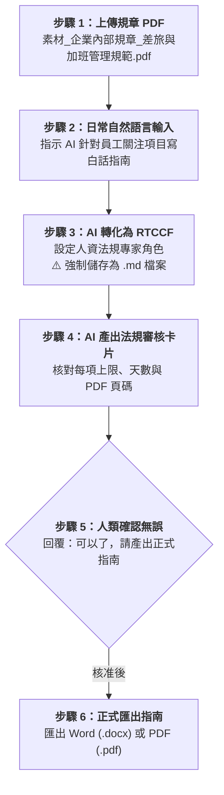

# 實戰範例 02：企業差旅規章萃取員工指南（Word / PDF）

> 🟢 **適用代理平台**：Claude.ai / ChatGPT / Gemini / Google Antigravity  
> 🛠️ **建議執行模式**：**軌道二：素材 Grounding 協作軌**（上傳規章 PDF 附件 ➔ 自然語言提需求 ➔ 轉 RTCCF 存為 `.md` ➔ 條文審核卡片 ➔ 匯出員工指南 Word/PDF）

---

## 📥 學員實戰素材與交付成品

- **必載輸入素材**：
  - [**`素材_企業內部規章_差旅與加班管理規範.pdf`**](./素材_企業內部規章_差旅與加班管理規範.pdf) *(3 頁正式公司規章，亦可使用 [純文字檔](./素材_企業內部規章_差旅與加班管理規範.txt))*
- **核心交付成品**：
  - [**`員工差旅報銷與加班權益指南_範本.md`**](./員工差旅報銷與加班權益指南_範本.md) *(由 AI 依據素材精準萃取之白話版員工權益指南，可一鍵轉為 Word (.docx) 或 PDF (.pdf))*

---

## 🏆 案例情境與業務痛點

許多公司的人資規章長達數十頁、文字艱澀，同仁出差報銷或加班時經常：
1. **找不到關鍵規定**：搞不清楚高鐵搭乘資格、住宿上限是多少、出差幾天內要報銷。
2. **詢問人資造成負擔**：重複問題天天問，耗費人資大量答覆時間。
3. **AI 隨意回答產生幻覺**：若沒有上傳真實規章 PDF，AI 會自行瞎掰外部法規，造成內部違規風險。

---

## ⚡ 人機協商工作流程（Human-in-the-Loop）

---

## 📖 核心章節導覽

- **[步驟 1：2-1_白話自然語言發想提示詞.md](./2-1_白話自然語言發想提示詞.md)**  
  學員上傳 PDF 附件後，輸入白話需求範例。
- **[步驟 2：2-2_AI產出之RTCCF差旅規章萃取提示詞.md](./2-2_AI產出之RTCCF差旅規章萃取提示詞.md)**  
  AI 生成之標準 RTCCF Grounding 提示詞，**必須儲存為 `.md` 檔案**。
- **[步驟 3 & 4：2-3_差旅審核卡片與員工指南生成提示詞.md](./2-3_差旅審核卡片與員工指南生成提示詞.md)**  
  差旅審核卡片範本、人類核准指令與匯出操作說明。

---

[← 返回 Word與PDF文件生成模組](../README.md)
