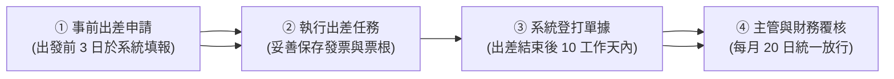

# 員工差旅報銷與加班權益精華指南

**依據規範**：星雲數位科技股份有限公司內部差旅辦法（文件編號：HR-SOP-2026-003）  
**適用對象**：全體受僱同仁  
**編制單位**：人力資源處 暨 財務部會計組  
**生效日期**：2026 年 01 月 01 日  

---

## 壹、差旅交通報銷標準

同仁因公出差應依據路程距離選擇合規之交通工具，憑票根或電子購票證明實報實銷：

1. **高鐵（台灣高鐵）**：
   - **搭乘資格**：出差地點單程距離距公司或起點超過 **80 公里**，或跨越非相鄰之縣市。
   - **座位標準**：以**標準車廂**為限，若搭乘商務車廂，其差額應由同仁自理。
2. **市區大眾運輸與計程車**：
   - 到達目的地後之市區交通，以搭乘捷運、公車為原則。
   - 若遇**緊急突發公務、公用大型展示設備運送或深夜時段（22:00 後）**，得搭乘計程車，報銷時須於備註欄載明起訖地點及搭乘事由。
3. **私車公用**：
   - 經主管核准駕駛自有車輛出差者，依每公里 **NT$ 8 元**補貼里程與油資（高速公路通行費憑 eTag 明細實報實銷）。

---

## 貳、住宿與膳雜津貼上限

差旅住宿費用採「檢據實報實銷」制，以每人每晚不超過以下上限為原則：

| 地區分類 | 每晚住宿補助上限 (含稅) | 膳雜費定額津貼 (免附憑證) | 備註規範 |
| :--- | :--- | :--- | :--- |
| **六都直轄市** (雙北、桃、中、南、高) | **NT$ 2,800 元** | **NT$ 400 元 / 日** | 超出上限部分需由同仁自付或事先特簽 |
| **非六都其他縣市** | **NT$ 2,200 元** | **NT$ 400 元 / 日** | 同性別同仁同行建議兩人一室（上限×1.5倍） |
| **當日往返（無住宿）** | 不適用 | **NT$ 200 元 / 日** | 僅補貼誤餐與在地茶水費 |

> 📌 **發票開立注意事項**：所有住宿及餐飲單據抬頭必須為**「星雲數位科技股份有限公司」**，並載明統一編號 **`88996655`**。

---

## 參、核銷作業流程與時效性

- **時效鐵律**：同仁應於出差行程結束返工之日起 **10 個工作天內**，於內部 ERP 差旅系統完成報銷登打並送出單據。
- **逾期處理**：超過 10 個工作天未送審且無不可抗力事由者，財務部門得退回該筆請款，請同仁務必維護自身權益。

---

## 肆、平日加班與換休權益

為保障同仁身心健康並落實勞動基準法規範，加班應於事前經單位主管指派或同意：

1. **平日延長工時加給標準**：
   - **延長工時第 1 至 2 小時**：按平日每小時工資額加給 **三分之一以上（1.33 倍）**。
   - **延長工時第 3 小時起**：按平日每小時工資額加給 **三分之二以上（1.66 倍）**。
2. **換休（補休）選擇權**：
   - 同仁得依個人意願於系統自由選擇**「領取加班費」**或**「換取補休（1:1 等額時數）」**。
   - 換休時數之有效期限為**自加班日起算 6 個月**；屆期未休完之時數，人資系統將全數自動結算轉發現金加班費。

---

## 伍、常見問題 Q&A 快速解答

- **Q1：出差住飯店，如果透過 Booking.com / Agoda 刷卡可以報銷嗎？**  
  *A1：可以，但務必於訂房時選擇開立「台灣電子發票（含統編 88996655）」；若為境外平台發票，需確認載明企業抬頭並附上信用卡扣款明細清單。*
- **Q2：高鐵票若在手機 App 上訂票，沒有實體紙本怎麼辦？**  
  *A2：請於搭乘後透過「台灣高鐵 App」下載「電子車票購票證明 (PDF)」，直接上傳差旅系統即可，免列印紙本。*

---

**諮詢窗口**：人資處分機 #2102（差旅規範）｜ 財務處分機 #3108（單據發票報銷）
