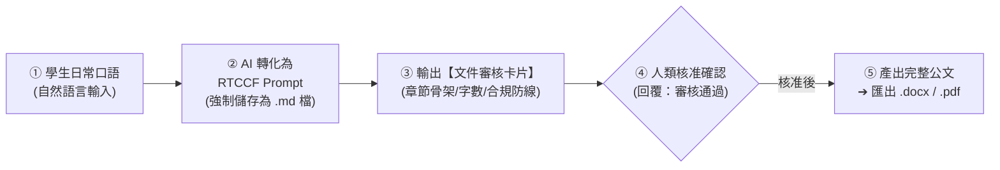

# Word (.docx) 與 PDF (.pdf) 文件生成模組
## 🚀 跨平台 AI 公文、企劃與報告實戰（Claude × ChatGPT × Gemini × Antigravity）

> **模組目標**：非技術同仁常面臨公文排版、專案企劃書與法規指引撰寫的繁瑣流程。本模組示範如何透過**「白話自然語言 ➔ RTCCF 提示詞（強制存為 `.md`）➔ 文件審核卡片（人機協商）➔ 正式匯出 Word (.docx) 或 PDF (.pdf)」**，建立高嚴謹度、高效率的公務文件產出閉環。

---

## 🧭 人機協作標準工作流（Human-in-the-Loop）

---

## 📚 次資料夾實戰範例導覽

本模組收錄兩大核心商業實戰範例，每個範例皆為獨立次資料夾，提供完整提示詞流程與範例檔案：

| 次範例主題 | 協作軌道 | 核心業務場景 | 核心交付成果 |
| :--- | :--- | :--- | :--- |
| **[01. 專案企劃書與推動計畫](./01_專案企劃書與推動計畫/README.md)** | **軌道一：Prompt 協作軌** | 零門檻口語發想，規劃 1,500 字「2026 年度辦公室 AI 賦能推動計畫書」 | 📄 [`2026年度辦公室AI賦能推動計畫書_範本.md`](./01_專案企劃書與推動計畫/2026年度辦公室AI賦能推動計畫書_範本.md) ➔ 匯出 `.docx` / `.pdf` |
| **[02. 企業差旅規章萃取員工指南](./02_企業差旅規章萃取員工指南/README.md)** | **軌道二：素材 Grounding 軌** | 上傳內部 3 頁差旅管理辦法 PDF，零幻覺提煉差旅報銷與加班指南 | 📘 [`員工差旅報銷與加班權益指南_範本.md`](./02_企業差旅規章萃取員工指南/員工差旅報銷與加班權益指南_範本.md) ➔ 匯出 `.docx` / `.pdf` |

---

## 📥 各平台匯出 Word (.docx) 與 PDF (.pdf) 指南

1. **Google Gemini**：在回覆區右下角點選「**分享與匯出**」➔「**匯出至 Google 文件**」，接著在 Google 文件選單點選「**檔案**」➔「**下載**」➔ 下載為 **Microsoft Word (.docx)** 或 **PDF 文件 (.pdf)**。
2. **Claude (Claude.ai)**：右側 **Artifacts** 面板富文本一鍵複製，貼入 Word 保留全部字體與樣式，並另存為 PDF。
3. **ChatGPT**：在 **Canvas** 面板檢視與局部修訂，點選右上方下載或列印另存為 PDF。
4. **Google Antigravity**：可直接在對話中指示 Agent 自動將生成的 Markdown 文件編譯輸出為工作區內的 `.docx` 或 `.pdf` 實體檔案。

---

[← 返回辦公室全能應用導覽總表](../README.md)
