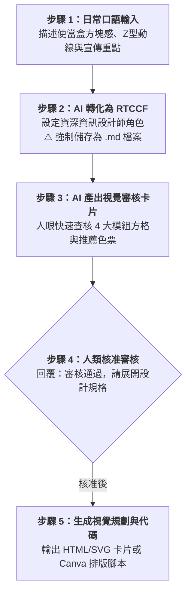

# 實戰範例 01：便當盒排版法：AI協作賦能宣傳圖表（Infographic）

> 🟢 **適用代理平台**：Claude.ai / ChatGPT / Gemini / Google Antigravity  
> 🛠️ **建議執行模式**：**軌道一：Prompt 協作軌**（白話口語發想 ➔ RTCCF 便當盒規格書強制存為 `.md` ➔ 視覺設計審核卡片 ➔ 生成 HTML/SVG 視覺卡片或 Canva 腳本）

---

## 📥 學員實戰素材與交付成品

- **核心交付成品**：
  - [**`便當盒視覺卡片_已完成.html`**](./便當盒視覺卡片_已完成.html) *(由 AI 規劃之 Bento Box 網格系統高質感資訊圖表，支援瀏覽器即時預覽、向量縮放與社群截圖分享)*

---

## 🏆 案例情境與業務痛點

想製作一張「傳統辦公 vs. 生成式 AI 協作賦能」的宣傳懶人包發在公司社群或公佈欄：
1. **沒有設計師支援**：非技術同仁不會使用 Illustrator 或 Photoshop，排版容易雜亂。
2. **文字過多無人閱讀**：讀者停留時間僅 15~30 秒，長文根本沒有人想看。
3. **資訊缺乏模組化**：沒有掌握 Bento Box 便當盒網格，版面零散沒有焦點。

---

## ⚡ 人機協商工作流程（Human-in-the-Loop）

---

## 📖 核心章節導覽

- **[步驟 1：1-1_白話自然語言發想提示詞.md](./1-1_白話自然語言發想提示詞.md)**  
  學員白話輸入發想指令。
- **[步驟 2：1-2_AI產出之RTCCF便當盒規格書提示詞.md](./1-2_AI產出之RTCCF便當盒規格書提示詞.md)**  
  AI 生成之標準 RTCCF Bento Box 設計提示詞，**必須儲存為 `.md` 檔案**。
- **[步驟 3 & 4：1-3_視覺設計審核卡片與視覺代碼生成提示詞.md](./1-3_視覺設計審核卡片與視覺代碼生成提示詞.md)**  
  視覺設計審核卡片範本、核准指令與視覺代碼生成操作。

---

[← 返回資訊圖表生成模組](../README.md)
