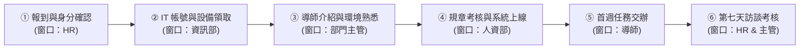

# 步驟 3：動線審核卡片與 Mermaid 流程代碼生成提示詞

## 🛡️ 人機協商閘門：AI 產出的「新人 SOP 資訊圖表審核卡片」

在展開詳細視覺規劃前，AI 呈現審核卡片：

```markdown
📋【新人 SOP 資訊圖表審核卡片 (Review Card)】—— 請使用者確認

【圖表規格概要】
• 來源基礎：新進同仁到職七天SOP指南 (共 6 大流程階段)
• 推薦動線：蛇形流程動線 (S-Curve) —— 最適合 5 步以上連續流程，由左至右蜿蜒前進
• 推薦風格：教學風格 (Explanatory) —— 線條簡潔，圖標親切明快

【包含核心步驟】：
Step 1. 報到與身分確認 (HR)
Step 2. IT 帳號與設備領取 (資訊部)
Step 3. 部門導師介紹與環境熟悉 (部門主管)
Step 4. 規章考核與公文系統上線 (人資部)
Step 5. 第一週業務任務交辦 (導師)
Step 6. 第七天回饋訪談與考核 (HR & 主管)

👉 請確認動線與流程是否合適。若確認無誤，請回覆：【審核通過，請產出視覺圖表】。
```

---

## 💬 人類核准指令

```text
審核通過，請產出視覺圖表。
```

---

## 📥 落地產出代碼（Mermaid 流程圖）



高質感網頁成果請開啟：[**`新人到職SOP_視覺流程圖解_已完成.html`**](./新人到職SOP_視覺流程圖解_已完成.html)。

---

[← 返回步驟 2](./2-2_AI產出之RTCCF新人SOP流程圖表提示詞.md) ｜ [返回範例導覽](./README.md)
