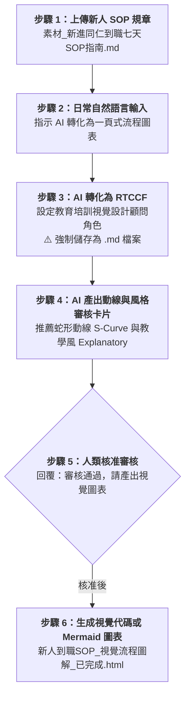

# 實戰範例 02：新人到職 SOP 指南轉蛇形流程圖解（Infographic）

> 🟢 **適用代理平台**：Claude.ai / ChatGPT / Gemini / Google Antigravity  
> 🛠️ **建議執行模式**：**軌道二：素材 Grounding 協作軌**（上傳新人 SOP 規章附件 ➔ 自然語言提需求 ➔ 轉 RTCCF 存為 `.md` ➔ 動線與風格審核卡片 ➔ 生成蛇形動線 S-Curve 流程圖解）

---

## 📥 學員實戰素材與交付成品

- **必載輸入素材**：
  - [**`素材_新進同仁到職七天SOP指南.md`**](./素材_新進同仁到職七天SOP指南.md) *(長篇規章，亦可使用 [純文字檔](./素材_新進同仁到職七天SOP指南.txt))*
- **核心交付成品**：
  - [**`新人到職SOP_視覺流程圖解_已完成.html`**](./新人到職SOP_視覺流程圖解_已完成.html) *(由 AI 規劃之教學風 Explanatory 6 階段垂直/蛇形流程圖解，支援瀏覽器即時預覽與 Mermaid 代碼)*

---

## 🏆 案例情境與業務痛點

新人第一天報到，面對厚厚一本數千字的 SOP 手冊：
1. **記不住步驟順序**：不知道 IT 設備要去哪裡領、帳號找誰開、第幾天要做資安測驗。
2. **缺乏視覺指引**：純文字條列令人昏昏欲睡，無法留下深刻印象。
3. **沒有選對動線與風格**：超過 5 個步驟若用一般表格很難看清遞進關係，最適合採用「蛇形流程 (S-Curve)」或「垂直線性 (Vertical)」。

---

## ⚡ 人機協商工作流程（Human-in-the-Loop）

---

## 📖 核心章節導覽

- **[步驟 1：2-1_白話自然語言發想提示詞.md](./2-1_白話自然語言發想提示詞.md)**  
  上傳規章後，輸入白話需求範例。
- **[步驟 2：2-2_AI產出之RTCCF新人SOP流程圖表提示詞.md](./2-2_AI產出之RTCCF新人SOP流程圖表提示詞.md)**  
  AI 生成之標準 RTCCF 流程圖表提示詞，**必須儲存為 `.md` 檔案**。
- **[步驟 3 & 4：2-3_動線審核卡片與Mermaid流程代碼生成提示詞.md](./2-3_動線審核卡片與Mermaid流程代碼生成提示詞.md)**  
  動線與風格審核卡片範本、核准指令與 Mermaid / HTML 產出。

---

[← 返回資訊圖表生成模組](../README.md)
