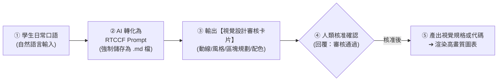
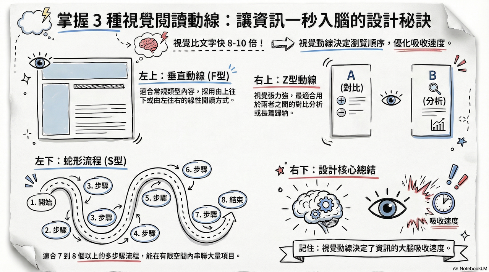
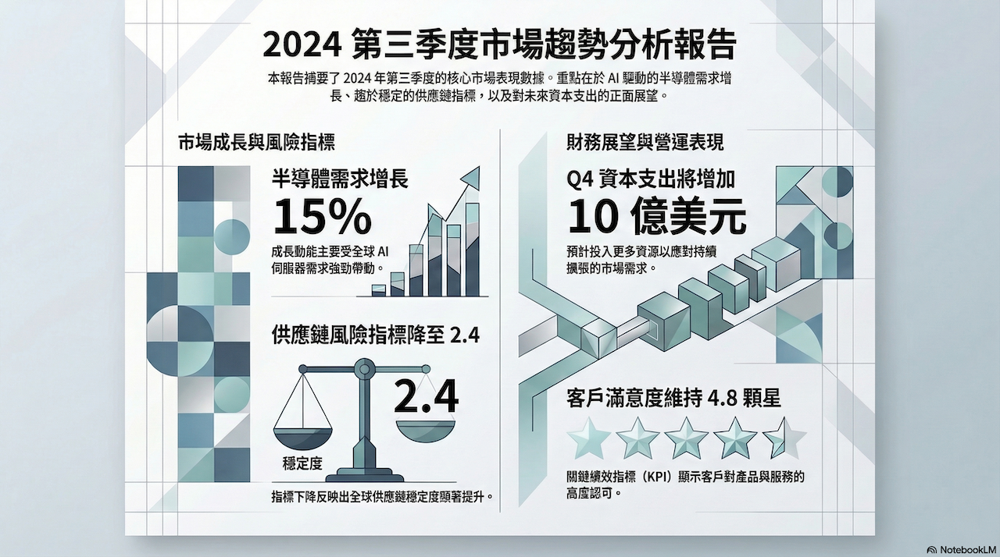
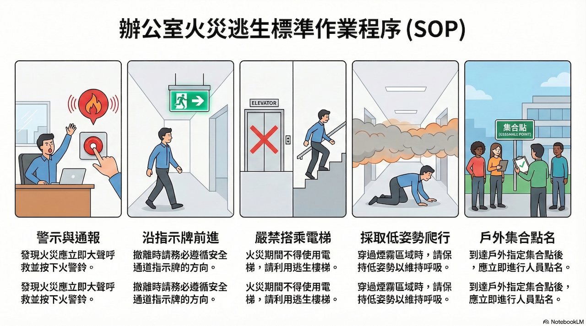
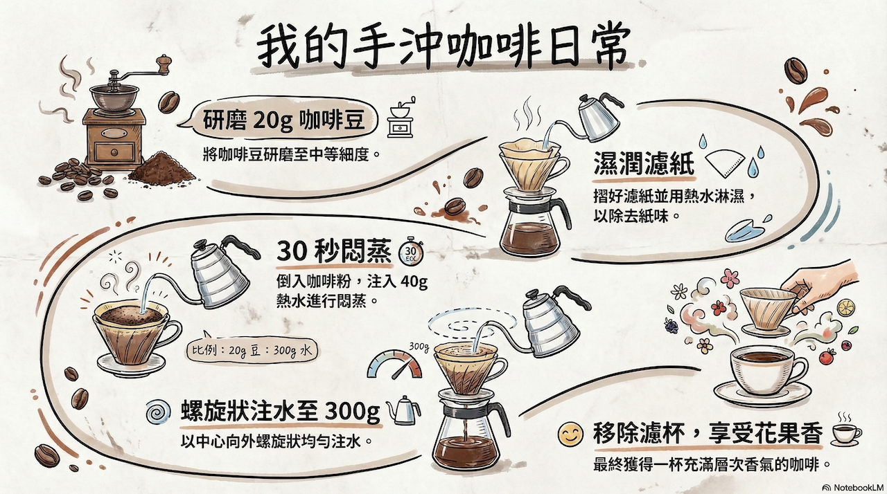

# 全自動資訊圖表 (Infographic) 生成模組
## 🚀 跨平台 AI 資訊設計實戰（Claude × ChatGPT × Gemini × Antigravity）

> **模組目標**：非技術人員與初學者「完全不必具備設計底子或複雜的 Prompt 技能」！只要說出想要宣傳的白話內容，透過人機協作機制，讓 AI 自動轉化為標準 **RTCCF 格式**並**強制儲存為 Markdown 檔案 (`.md`)**。在正式產出視覺圖表前，強制通過**「視覺設計審核卡片」**讓人眼快速核對動線佈局、模組內容與風格配色，待使用者說「可以了」才產出高質感的 **商務資訊圖表（Infographic）** 規格書、SVG 向量代碼或視覺呈現。全面適用於 **Claude.ai、ChatGPT、Gemini 與 Antigravity**。

---

## 🧭 人機協作標準工作流（Human-in-the-Loop）

---

## 📚 次資料夾實戰範例導覽

本模組收錄兩大核心商業實戰範例，每個範例皆為獨立次資料夾，提供完整提示詞流程、素材與產出範本：

| 次範例主題 | 協作軌道 | 核心業務場景 | 核心交付成果 |
| :--- | :--- | :--- | :--- |
| **[01. 便當盒排版法：AI協作賦能宣傳圖表](./01_便當盒排版法_AI協作賦能宣傳圖表/README.md)** | **軌道一：Prompt 協作軌** | 白話口語發想，產出 Z 型動線 Bento Box 便當盒一頁式懶人包規格書與高質感 HTML/SVG 視覺卡片 | 🖼️ [`便當盒視覺卡片_已完成.html`](./01_便當盒排版法_AI協作賦能宣傳圖表/便當盒視覺卡片_已完成.html) |
| **[02. 新人到職SOP指南轉蛇形流程圖解](./02_新人到職SOP指南轉蛇形流程圖解/README.md)** | **軌道二：素材 Grounding 軌** | 上傳內部 6 步驟新人到職規章，自動規劃 S-Curve 蛇形動線並輸出清晰流程圖解 | 📊 [`新人到職SOP_視覺流程圖解_已完成.html`](./02_新人到職SOP指南轉蛇形流程圖解/新人到職SOP_視覺流程圖解_已完成.html) |

---

## 📐 10 大視覺風格與 3 大閱讀動線速查表

### 3 大閱讀動線：
1. **垂直線性動線 (Vertical)**：由上往下延伸，適合列表類內容、單向 SOP 拆解。
2. **Z 型動線 (Z-Pattern)**：左上 ➔ 右上 ➔ 左下 ➔ 右下，適合方案對比與四象限分析。
3. **蛇形流程動線 (S-Curve)**：蛇行蜿蜒前進，適合超過 5 步以上的長條型步驟與時間軸。

---

### 10 大視覺風格：

| 風格名稱 | 核心視覺特色 | 最合適場景 | 風格展示 |
| :--- | :--- | :--- | :--- |
| **便當盒法 (Bento Box)** | 模組化方格、規整分類 | 功能清單、產品規格與成效對比 |  |
| **專業風 (Professional)** | 冷色調、乾淨網格、高對比 | 商務會議、正式年度報告 |  |
| **教學風 (Explanatory)** | 簡約線條、流程導向 | 員工培訓手冊、SOP 流程圖解 |  |
| **社論風 (Editorial)** | 雜誌排版感、文字圖表交錯 | 專案觀點評論、趨勢專題 |  |
| **積木風 (Blocks)** | 幾何方塊、模組化立體視覺 | 系統架構、組織圖、專案階段 |  |
| **手繪風 (Hand-drawn)** | 不規則線條、類筆觸感 | 創意發想、具溫度的品牌故事 |  |
| **可愛風 / 黏土風 / 動漫風 / 科學風** | 依情境與目標受眾親和力靈活切換 | 活動海報、生活指南、科普宣導 |  |

---

[← 返回辦公室全能應用導覽總表](../README.md)
