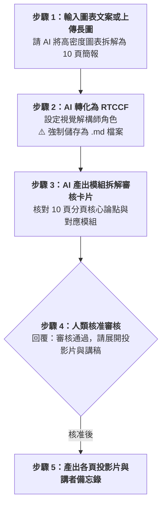

# 實戰範例 01：資訊圖表拆解為簡報（放大鏡原則）

> 🟢 **適用代理平台**：Claude.ai / ChatGPT / Gemini / Google Antigravity  
> 🛠️ **建議執行模式**：**由大到小（拆解）**（將一張高密度長圖拆解為 10~15 頁線性簡報，適合深度演講與教學）

---

## 🏆 案例情境與設計心法

當手上有現成的業務架構或流程資訊圖表（如長圖或海報），直接貼在 PPT 會造成觀眾看不清小字。本範例示範「放大鏡原則」：
1. **找出「視覺模組」**：每一個數據區塊、步驟或邏輯層級，獨立成為 1 頁投影片。
2. **加入講者敘事**：將圖表原有的極簡文字標籤，擴充為講者專屬的口頭引言與案例。
3. **動態呈現**：引導投影片依序出現，消除觀眾認知過載。

---

## ⚡ 人機協商工作流程（Human-in-the-Loop）

---

## 📖 核心章節導覽

- **[步驟 1：1-1_白話自然語言發想提示詞.md](./1-1_白話自然語言發想提示詞.md)**  
  學員白話發想指令。
- **[步驟 2：1-2_AI產出之RTCCF圖表拆解簡報提示詞.md](./1-2_AI產出之RTCCF圖表拆解簡報提示詞.md)**  
  AI 生成之標準 RTCCF 拆解提示詞，**必須儲存為 `.md` 檔案**。
- **[步驟 3 & 4：1-3_視覺模組審核卡片與分頁投影片生成提示詞.md](./1-3_視覺模組審核卡片與分頁投影片生成提示詞.md)**  
  審核卡片範本、核准指令與投影片產出說明。

---

[← 返回簡報與圖表差異總覽](../README.md)
