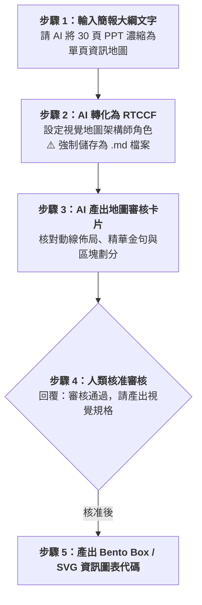

# 實戰範例 02：簡報組合成資訊圖表（導覽圖原則）

> 🟢 **適用代理平台**：Claude.ai / ChatGPT / Gemini / Google Antigravity  
> 🛠️ **建議執行模式**：**由小到大（濃縮）**（將 30 頁線性投影片去蕪存菁，濃縮為一頁長圖或資訊海報，適合課後複習與社群傳播）

---

## 🏆 案例情境與設計心法

演講結束後，觀眾很少會再次翻開 30 頁 PPT 逐頁複習。本範例示範「導覽圖原則」：
1. **關鍵提取**：每一頁簡報只提取一個最核心的數據或結論金句。
2. **視覺地圖化**：決定資訊流向（Top-Down、Z-Pattern 或 S-Curve），將原本分開的頁面用視覺線索連起來。
3. **層級重整**：最重要的結論放大，次要數據縮小，建立視覺自明性。

---

## ⚡ 人機協商工作流程（Human-in-the-Loop）

---

## 📖 核心章節導覽

- **[步驟 1：2-1_白話自然語言發想提示詞.md](./2-1_白話自然語言發想提示詞.md)**  
  學員白話濃縮指令。
- **[步驟 2：2-2_AI產出之RTCCF簡報濃縮圖表提示詞.md](./2-2_AI產出之RTCCF簡報濃縮圖表提示詞.md)**  
  AI 生成之標準 RTCCF 濃縮提示詞，**必須儲存為 `.md` 檔案**。
- **[步驟 3 & 4：2-3_邏輯地圖審核卡片與一頁視覺規格生成提示詞.md](./2-3_邏輯地圖審核卡片與一頁視覺規格生成提示詞.md)**  
  邏輯地圖審核卡片範本、核准指令與資訊圖表規格產出。

---

[← 返回簡報與圖表差異總覽](../README.md)
