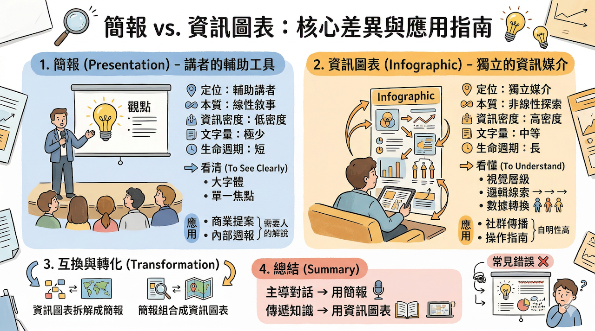

# 簡報 vs. 資訊圖表：核心差異與互換實戰指南
## 🚀 視覺傳達本質解析與跨媒體原子化轉化（Claude × ChatGPT × Gemini × Antigravity）

> **模組目標**：在視覺傳達的領域中，「簡報」（Presentation）與「資訊圖表」（Infographic）常被混淆。雖然兩者都運用視覺元素來傳遞訊息，但其**設計邏輯**與**溝通本質**卻大相徑庭。本模組深入剖析兩者差異，並提供「由大到小（放大鏡原則）」與「由小到大（導覽圖原則）」的雙向互換實戰工作流。

---

## 1. 核心定義與定位

### 簡報 (Presentation)
- **定位：** 講者的輔助工具。
- **本質：** 線性的敘事過程。它通常需要「人」的解說才能完整，簡報本身是配角，講者才是主角。

### 資訊圖表 (Infographic)
- **定位：** 獨立的資訊媒介。
- **本質：** 非線性的探索過程。它必須具備「自明性」（Self-explanatory），即便沒有解說者，讀者也能自行讀懂內容。

---

## 2. 深度維度對比表

| 維度 | 簡報 (Presentation) | 資訊圖表 (Infographic) |
| :--- | :--- | :--- |
| **資訊密度** | **低密度**。強調單一焦點，避免觀眾分心。 | **高密度**。將大量數據與邏輯壓縮在單一畫面。 |
| **敘事結構** | **線性**。由講者掌控翻頁，有前後順序。 | **非線性**。讀者可自由跳讀，自行發現關聯。 |
| **存在形式** | 多頁幻燈片 (Slides)。 | 單一長圖、海報或網頁版面。 |
| **閱讀主動性** | 聽眾是被動的，節奏由講者控制。 | 讀者是主動的，可自由決定停留時間。 |
| **文字量** | 極少。僅保留標題與關鍵字。 | 中等。包含必要的數據標籤與短敘述。 |
| **生命週期** | 演講結束後，其價值隨之大幅下降。 | 具備長效傳播性，適合社群分享與參考。 |

---

## 3. 視覺設計邏輯

### 簡報：為了「看清」
1. **大字體：** 確保最後一排觀眾也能看見。
2. **視覺焦點：** 每頁只說一件事（One Slide, One Idea）。
3. **情感連結：** 大量的圖像與留白，用來營造氛圍或情緒。

### 資訊圖表：為了「看懂」
1. **視覺層級：** 透過大小、顏色區分資訊的重要程度。
2. **邏輯線索：** 使用箭頭、線條或區塊引導讀者的視線流動。
3. **數據轉換：** 將枯燥的數字轉化為直觀的圖示（如：用 10 個小人圖代表 10%）。

---

## 📚 次資料夾實戰範例導覽

簡報與資訊圖表並非互斥，它們可以透過「解構」與「重組」進行互相轉換。本章節提供兩大次範例實戰：

| 次範例主題 | 轉化方向 | 核心設計原則 | 次資料夾連結 |
| :--- | :--- | :--- | :--- |
| **[01. 資訊圖表拆解為簡報](./01_資訊圖表拆解為簡報_放大鏡原則/README.md)** | 由大到小（拆解） | **放大鏡原則**：將高密度長圖拆解為 10~15 頁線性簡報，適合深度教學 | [點此前往](./01_資訊圖表拆解為簡報_放大鏡原則/README.md) |
| **[02. 簡報組合成資訊圖表](./02_簡報組合成資訊圖表_導覽圖原則/README.md)** | 由小到大（濃縮） | **導覽圖原則**：將 30 頁投影片去蕪存菁濃縮為一頁長圖，適合課後複習與傳播 | [點此前往](./02_簡報組合成資訊圖表_導覽圖原則/README.md) |

---

## 5. 常見的錯誤：誤把資訊圖表當簡報

- **現象：** 講者將密密麻麻的資訊圖表直接貼在 PPT 上。
- **結果：** 觀眾會忙著讀圖上的小字，完全聽不進講者的話，造成嚴重的「認知過載」。
- **解決方案：** 如果你必須在簡報中引用資訊圖表，請**將其拆解**（參考次範例 01）。

---

[← 返回辦公室全能應用導覽總表](../README.md)
