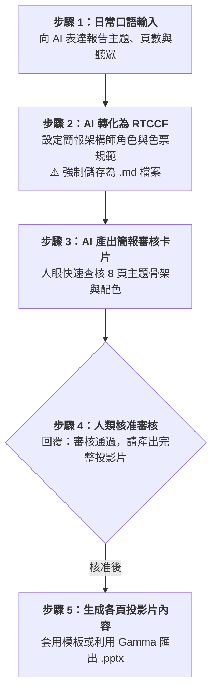

# 實戰範例 01：科技商務提案簡報企劃（PowerPoint）

> 🟢 **適用代理平台**：Claude.ai / ChatGPT / Gemini / Google Antigravity  
> 🛠️ **建議執行模式**：**軌道一：Prompt 協作軌**（日常口語需求 ➔ RTCCF 簡報企劃強制存為 `.md` ➔ 簡報審核卡片 ➔ Gamma 一秒轉 PPTX 或套版）

---

## 📥 學員實戰素材與交付成品

- **核心交付成品與模板**：
  - [**`商業科技簡報範例.pptx`**](./商業科技簡報範例.pptx) *(完成版 16:9 科技商務簡報投影片)*
  - [**`ptt簡報模版.pptx`**](./ptt簡報模版.pptx) *(開箱即用的科技風商務 PPT 母片模版)*
  - [**`簡報範例元素source/`**](./簡報範例元素source/) *(包含封面頁與內頁 1~3 視覺排版展示圖)*

---

## 🏆 案例情境與業務痛點

同仁需向總經理與各部門一級主管報告「企業導入生成式 AI 辦公室應用」效益：
1. **簡報字數塞滿螢幕**：把報告直接剪貼到投影片上，台上台下都在看小字，失去溝通本質。
2. **缺乏整體架構與色系**：投影片顏色五花八門，沒有科技感商務風格。
3. **頁數失控無法準時講完**：預計 10 分鐘的報告寫了 25 頁，主管沒耐心聽完。

---

## ⚡ 人機協商工作流程（Human-in-the-Loop）

---

## 📖 核心章節導覽

- **[步驟 1：1-1_白話自然語言發想提示詞.md](./1-1_白話自然語言發想提示詞.md)**  
  學員輸入白話簡報需求範例。
- **[步驟 2：1-2_AI產出之RTCCF簡報企劃提示詞.md](./1-2_AI產出之RTCCF簡報企劃提示詞.md)**  
  AI 生成之標準 RTCCF 簡報企劃提示詞，**必須儲存為 `.md` 檔案**。
- **[步驟 3 & 4：1-3_企劃審核卡片與PPTX匯出提示詞.md](./1-3_企劃審核卡片與PPTX匯出提示詞.md)**  
  簡報審核卡片範本、核准指令與匯出 PowerPoint (.pptx) 操作指引。

---

[← 返回簡報生成模組](../README.md)
