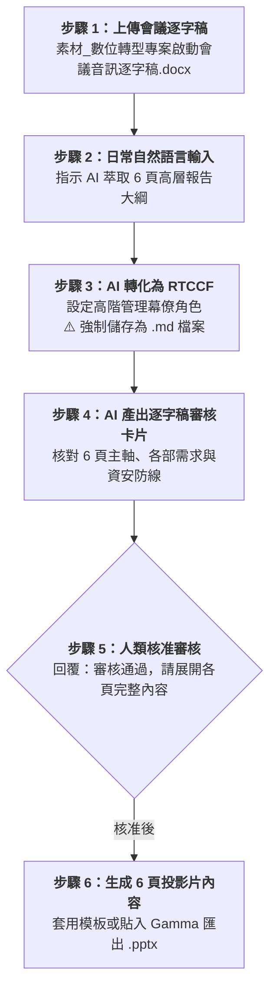

# 實戰範例 02：會議錄音逐字稿萃取管理簡報（PowerPoint）

> 🟢 **適用代理平台**：Claude.ai / ChatGPT / Gemini / Google Antigravity  
> 🛠️ **建議執行模式**：**軌道二：素材 Grounding 協作軌**（上傳逐字稿附件 ➔ 自然語言提需求 ➔ 轉 RTCCF 存為 `.md` ➔ 簡報審核卡片 ➔ 提煉 6 頁高階管理決策簡報大綱並套版）

---

## 📥 學員實戰素材與交付成品

- **必載輸入素材**：
  - [**`素材_數位轉型專案啟動會議音訊逐字稿.docx`**](./素材_數位轉型專案啟動會議音訊逐字稿.docx) *(長篇會議逐字稿，亦可使用 [純文字檔](./素材_數位轉型專案啟動會議音訊逐字稿.txt))*
- **核心交付成品**：
  - [**`數位轉型專案啟動會議_管理簡報大綱.md`**](./數位轉型專案啟動會議_管理簡報大綱.md) *(由 AI 去蕪存菁提煉之 6 頁高階管理決策投影片大綱，可一鍵轉為 `.pptx`)*

---

## 🏆 案例情境與業務痛點

高階主管會議動輒開 2 小時，產生數萬字音訊逐字稿：
1. **逐字稿又長又雜**：充滿口語助詞、跨部門發散討論，老闆沒時間閱讀全文。
2. **缺乏結構化決策點**：無法快速提煉出「總經理指示、各部需求、資安防線、培訓時程」。
3. **AI 隨意歸納容易漏看**：若未經人機協作審核卡片查核，容易遺漏關鍵交辦事項。

---

## ⚡ 人機協商工作流程（Human-in-the-Loop）

---

## 📖 核心章節導覽

- **[步驟 1：2-1_白話自然語言發想提示詞.md](./2-1_白話自然語言發想提示詞.md)**  
  上傳逐字稿後，輸入白話需求範例。
- **[步驟 2：2-2_AI產出之RTCCF逐字稿提煉提示詞.md](./2-2_AI產出之RTCCF逐字稿提煉提示詞.md)**  
  AI 生成之標準 RTCCF 逐字稿提煉提示詞，**必須儲存為 `.md` 檔案**。
- **[步驟 3 & 4：2-3_逐字稿簡報審核卡片與投影片生成提示詞.md](./2-3_逐字稿簡報審核卡片與投影片生成提示詞.md)**  
  逐字稿簡報審核卡片範本、核准指令與匯出操作指引。

---

[← 返回簡報生成模組](../README.md)
