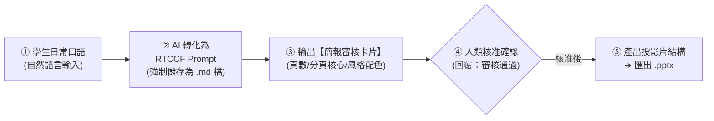

# PowerPoint (.pptx) 簡報生成模組
## 🚀 跨平台 AI 商業簡報大綱萃取與 PPTX 實戰（Claude × ChatGPT × Gemini × Antigravity）

> **模組目標**：非技術人員常為製作高階主管報告、業務提案投影片耗費大量時間排版與構思。本模組示範如何透過**「日常口語對話 ➔ RTCCF 簡報企劃（強制存為 `.md`）➔ 簡報企劃審核卡片（人機協商）➔ 一秒匯出 PowerPoint (.pptx) 或套用模板」**，徹底擺脫投影片文字過多與論點發散。

---

## 🧭 人機協作標準工作流（Human-in-the-Loop）

---

## 📚 次資料夾實戰範例導覽

本模組收錄兩大核心商業實戰範例，每個範例皆為獨立次資料夾，提供完整提示詞流程、素材與產出範本：

| 次範例主題 | 協作軌道 | 核心業務場景 | 核心交付成果 |
| :--- | :--- | :--- | :--- |
| **[01. 科技商務提案簡報企劃](./01_科技商務提案簡報企劃/README.md)** | **軌道一：Prompt 協作軌** | 零門檻口語發想，規劃 8 頁「企業導入生成式 AI 效益」科技商務簡報，含色票與演講備忘錄 | 📊 [`商業科技簡報範例.pptx`](./01_科技商務提案簡報企劃/商業科技簡報範例.pptx) ＋ [`ptt簡報模版.pptx`](./01_科技商務提案簡報企劃/ptt簡報模版.pptx) |
| **[02. 會議錄音逐字稿萃取管理簡報](./02_會議錄音逐字稿萃取管理簡報/README.md)** | **軌道二：素材 Grounding 軌** | 上傳數千字之數位轉型啟動會議錄音逐字稿（Word/TXT），提煉 6 頁高層決策精華投影片 | 📑 [`數位轉型專案啟動會議_管理簡報大綱.md`](./02_會議錄音逐字稿萃取管理簡報/數位轉型專案啟動會議_管理簡報大綱.md) ➔ 套版匯出 `.pptx` |

---

## 🎨 科技商務配色與設計原則

- **深邃科技風**：主色深藍 `#1E2761`、強調色冰藍 `#CADCFC` 或青綠 `#00FFD0`。
- **閱讀黃金法則**：**一頁一重點（One Slide, One Idea）**，切忌將長段落文字直接複製到簡報上。
- **排版技巧**：文字盡量採用「**粗體關鍵字** + 簡要短語」，讓台下主管在 3 秒內抓住核心論點。

---

[← 返回辦公室全能應用導覽總表](../README.md)
