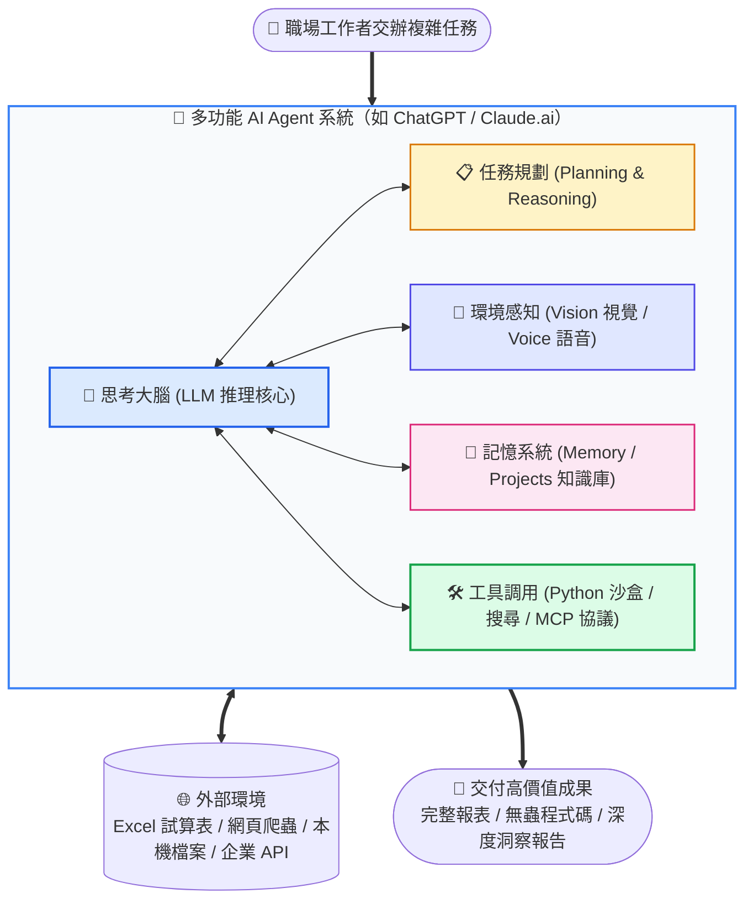

# 🤖 AI Agent 基本概念：從「單純生成」到「多功能自主代理」

> 💡 **核心認知躍升**：  
> **現在不該只談「生成式 AI」，而是要理解「AI Agent（智慧代理人）」！**  
> 過去的 AI 像只會打字的速記員；今天的 **ChatGPT** 與 **Claude.ai** 則是擁有大腦、眼睛、雙手與記憶的**多功能全能特助**。

---

## 📌 一分鐘看懂：為什麼稱呼要升級？

「生成」只描述了 AI 輸出文字或圖片的**單向反應**；但當前職場中，我們給 AI 一個長遠目標，它能**自己拆步驟、寫程式碼驗證、上網查證、甚至串接外部軟體**。

```
【傳統思維】 輸入提示詞 (Prompt) ➔ 吐出一段文字 (Text Generation)
     ⬇️
【現代 Agent 思維】 交代業務目標 (Goal) ➔ 規劃步驟 (Planning) ➔ 操作工具 (Tool Use) ➔ 交付實體成果 (Result)
```

---

## 🚀 演進歷程：從模型到多功能 Agent

| 階段 | 代表稱號 | 核心本質 | 職場能力與邊界 |
| :---: | :---: | :---: | :--- |
| **第一代**<br>*(2022以前)* | **語言模型 (LLM)** | 單向文字接龍<br>`Text in ➔ Text out` | 輸入提示詞，計算下一字機率。**無法聯網、無法開檔、無法操作工具**，容易一本正經地胡說八道。 |
| **第二代**<br>*(2023)* | **生成式應用程式** | 模型外掛介面<br>`Wrapper App` | 加上網頁聊天視窗，提供檔案上傳、語音輸入與基本聯網搜尋。 |
| **現代**<br>*(2024+)* | **多功能 AI Agent** | **大腦推理 + 自主規劃 + 工具調用 + 記憶系統** | **自主拆解複雜目標**、呼叫 Python 沙盒運算、透過 MCP 操控瀏覽器與資料庫、即時看圖除錯並在出錯時自我修正。 |

---

## 🧠 多功能 AI Agent 的五大核心支柱

當我們打開 **ChatGPT** 或 **Claude.ai**，幕後運作的不是單一模型，而是一整套**代理人閉環架構**：



### 🔍 支柱深度解析

```
┌────────────────────────────────────────────────────────────────────────┐
│ 1. 🧠 思考大腦 (LLM Engine)                                             │
│    • 核心職能：語意理解、邏輯推導、決策判斷與自然溝通。                │
│    • 角色定位：Agent 的中央神經元，解析你這句話背後的真正意圖。        │
├────────────────────────────────────────────────────────────────────────┤
│ 2. 📋 任務規劃 (Planning & Reasoning)                                  │
│    • 代表技術：OpenAI o1/o3 思考鏈、Claude Extended Thinking。        │
│    • 實務展現：面對「分析這季虧損原因」，AI 不會瞎猜，而是自動拆解：   │
│      ① 檢核資料格式 ➔ ② 執行數據運算 ➔ ③ 交叉比對 ➔ ④ 撰寫結論。     │
├────────────────────────────────────────────────────────────────────────┤
│ 3. 🛠️ 工具調用 (Tool Use & Code Execution) ⭐【最強分水嶺】           │
│    • 核心突破：大腦不擅長算大數字與記事實，因此 Agent 懂得「拿工具」！│
│    • 實務展現：                                                        │
│      - ChatGPT：自動啟動沙盒 Python 運算數據、繪製統計圖表。          │
│      - Claude.ai：執行 Python 產出 `.xlsx` 檔案，或透過 MCP 操作本機。 │
├────────────────────────────────────────────────────────────────────────┤
│ 4. 💾 記憶系統 (Memory & Projects)                                     │
│    • 核心職能：跨對話記住使用者的業務背景、組織文化、格式規範。        │
│    • 實務展現：ChatGPT Memory 記錄偏好、Claude Projects 注入內部規章。 │
├────────────────────────────────────────────────────────────────────────┤
│ 5. 👀 環境感知 (Multi-modal Perception)                                │
│    • 核心職能：看懂手繪草圖、皺褶發票、螢幕截圖，以及即時雙向語音互動。│
└────────────────────────────────────────────────────────────────────────┘
```

---

## 👔 職場實戰對比：打字員 vs 專業特助

| 維度 | 傳統打字員（純生成式 AI） | 全能專業特助（多功能 AI Agent） |
| :--- | :--- | :--- |
| **任務啟動** | 你下指令，他立刻生字；指令寫不清就生出一堆廢話。 | 你交代目標，他主動梳理邏輯並規劃具體執行清單。 |
| **遇到數據/計算** | 依靠文字機率「猜」數字，經常算錯造成嚴重業務事故。 | **自己寫 Python 跑算式**，保證 100% 數學與邏輯精準。 |
| **面臨資訊不足** | 為了交差而開始胡讅瞎編（產生幻覺）。 | **主動暫停並向你提問**（Human-in-the-Loop），或上網檢索。 |
| **最終交付成果** | 一段只能手動複製貼上的純文字。 | 產出結構化 Excel 檔案、可部署的代碼、已排定的行事曆。 |

> 📌 **給學習者的核心心法**：  
> 使用多功能 AI Agent 時，不需要把它當「神仙」膜拜，也不要把它當「搜尋引擎」。  
> **把你當成專案經理（PM），把 Agent 當成具備高智商與多種工具的實習特助** —— 明確交付目標、授予必要工具、設立驗證機制。

---

## 💬 課堂互動討論

> [!TIP]
> 歡迎分組討論以下 3 個問題，每組挑選 1 題分享職場實務觀察：

### 🗨️ 討論 1：辨識身邊的 Agent 行為
回想你最近使用 ChatGPT 或 Claude 的經驗，有哪些動作是它在「**操作工具**」（算數學、繪圖、跑代碼、爬梳網頁），而不只是「**陪你打字聊天**」？

### 🗨️ 討論 2：工作指令的心態轉變
當你認知到對方是「AI Agent」而非「打字員」時，你的提問方式（Prompting）會產生什麼改變？（提示：從「請寫一篇...」轉變為「我的目標是...，請規劃步驟並調用...」）

### 🗨️ 討論 3：安全邊界與授權
當 Agent 未來能夠直接發送 Email、刷卡下單或修改公司資料庫時，身為人類工作者的我們，該如何為它設計「中途確認機制（Human-in-the-Loop）」？

---

## 🎯 隨堂實戰測驗：這是 Agent 的哪項能力？

請閱讀以下 5 個日常辦公情境，判斷其調用了 AI Agent 的哪一項核心能力（**思考大腦**、**任務規劃**、**工具調用**、**記憶系統**、**環境感知**）：

| 編號 | 職場實際情境 | 調用的核心能力 |
| :---: | :--- | :---: |
| **1** | 手機拍下發票上傳，AI 精準抓出統一編號與消費金額 NT$ 1,280 | `[ 請作答 ]` |
| **2** | 提供 5,000 筆銷售記錄，AI 自行撰寫 Python 程式碼加總並產出趨勢圖 | `[ 請作答 ]` |
| **3** | 給予複雜專案目標，AI 輸出「階段一：資料收集 ➔ 階段二：異常排查 ➔ 階段三：產出報告」 | `[ 請作答 ]` |
| **4** | 下週開新對話時，AI 自動遵循「報告開頭必須列出 3 點 Executive Summary」的慣例 | `[ 請作答 ]` |
| **5** | 閱讀 30 頁採購合約，迅速抓出第 18 條隱藏的延遲交付違約條款與風險評估 | `[ 請作答 ]` |

<br>

<details>
<summary>👉 <b>點此展開答案與深度解析</b></summary>

<br>

| 編號 | 正確能力組件 | 深度解析 |
| :---: | :---: | :--- |
| **1** | **👀 環境感知 (Vision)** | 透過多模態視覺模型解析圖像中的光影與文字（OCR + 空間理解）。 |
| **2** | **🛠️ 工具調用 (Tool Use)** | 模型本身不擅長大數據計算，故自主調用代碼沙盒（Code Execution）運算，確保 0 計算誤差。 |
| **3** | **📋 任務規劃 (Planning)** | 發揮推理模型特性，將非結構化的大目標拆解為可執行的步驟路徑。 |
| **4** | **💾 記憶系統 (Memory)** | 跨 session 儲存使用者的專案風格與規範，提供高度個人化的工作流。 |
| **5** | **🧠 思考大腦 (LLM Engine)** | 展現強大的長文本理解、法律語意解析與邏輯風險推導能力。 |

</details>

---

## 🧭 延伸探索章節

- ➡️ [返回專案首頁](../README.md)
- ➡️ [進入 Prompt 核心心法：如何指揮你的 AI Agent](../prompt/README.md)
- ➡️ [探索 Claude.ai 實戰專案與技能庫](../Claude_ai/README.md)
- ➡️ [探索 ChatGPT 資料分析與進階工具](../ChatGPT/README.md)
