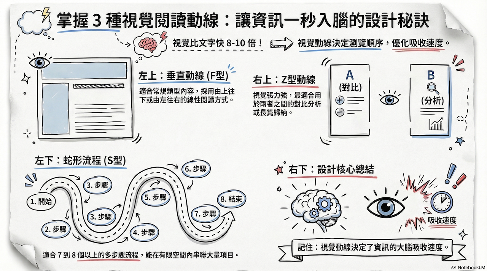
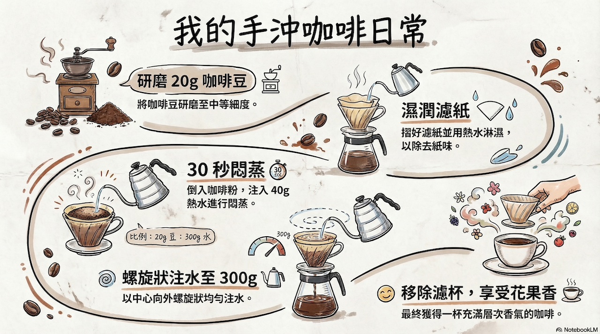
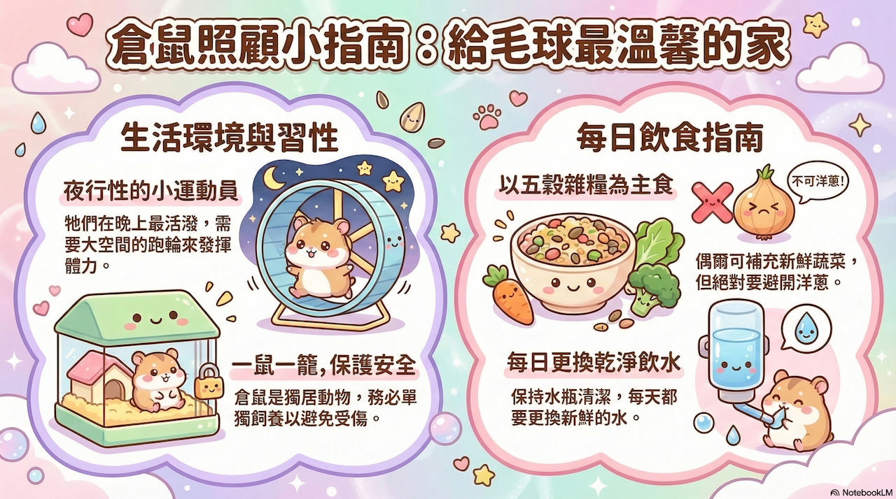
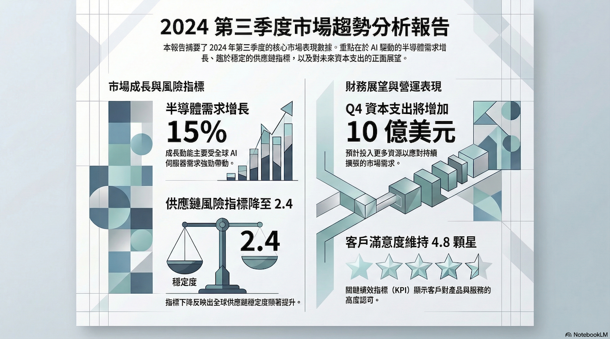
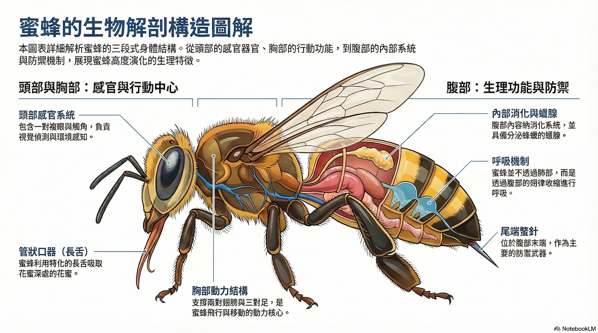
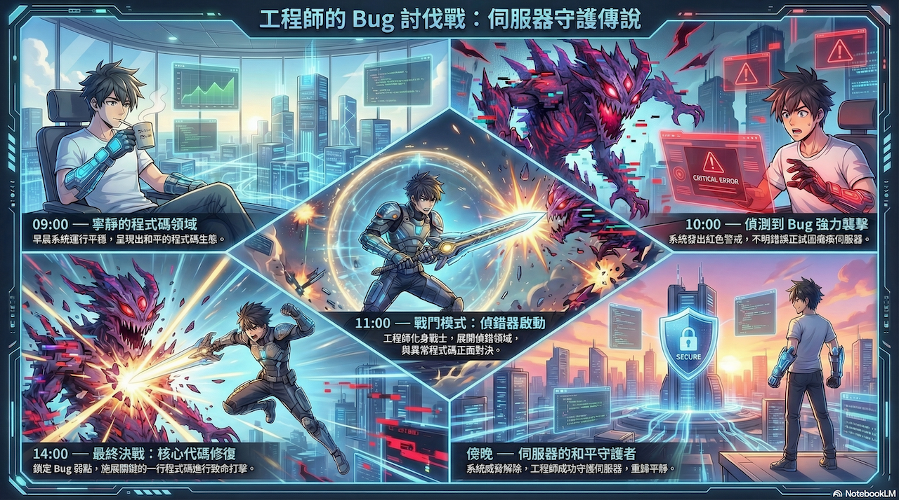
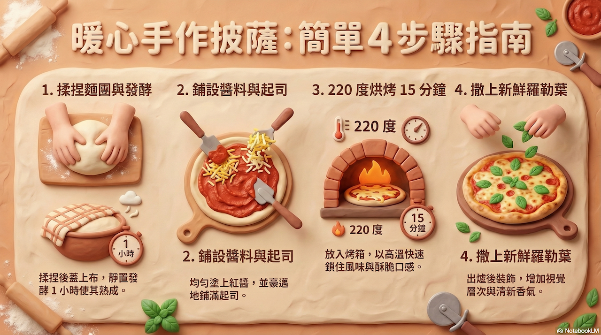
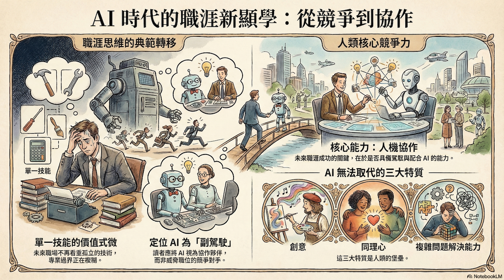
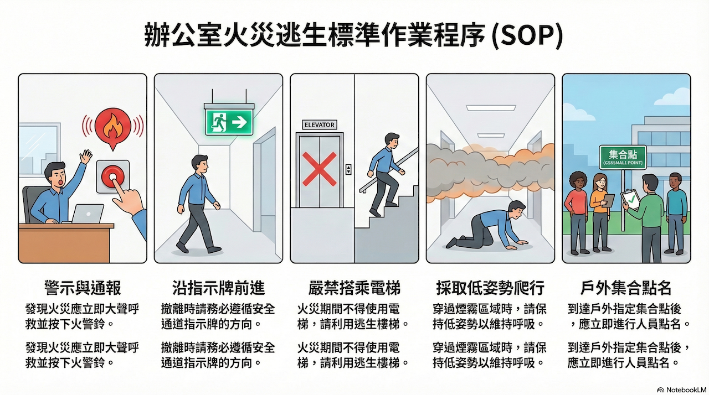
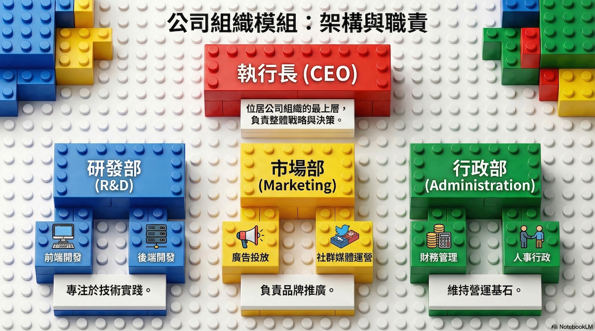

# NotebookLM 資訊圖表更新教學：10大風格 x 3大視覺動線全攻略

Google NotebookLM 於近期更新了資訊圖表（Infographic）功能，將圖表風格的選擇權交還給使用者，不再只靠 AI 隨機生成。透過**10種視覺風格**與**3種閱讀動線**的搭配，共可創造出 30 種不同的圖表變化。

---

## 一、 核心觀念：資訊圖表與簡報的本質差異

在製作之前，我們必須釐清資訊圖表的核心定位：

- **資訊密度（Density）**：簡報（Slides）是為演講設計，強調一頁一重點；而資訊圖表（Infographic）則是在單一畫面中，將大量的數據、流程與因果關係進行「結構化濃縮」。
- **認知速度（Cognition）**：科學研究指出，人類大腦處理視覺的速度比文字快 60,000 倍。好的圖表應讓讀者在 10 秒內抓到大框架，若看圖表比讀文字還累，就失去了視覺化的意義。
- **受眾分層（Audience）**：新手需要明確的引導（如動線與註解），而專業受眾則傾向於直接看到數據之間的關聯。

## 二、 決定資訊吸收速度：3 大閱讀動線

動線決定了讀者的「視覺旅程」。在 NotebookLM 資訊圖表旁的「鉛筆圖示」輸入指令，即可指定以下佈局：

### 1. 垂直線性動線 (Vertical / F-Pattern)

- **特色**：最符合網頁閱讀習慣，由上往下延伸。
- **適用場景**：列表類內容、簡單的因果邏輯、單一主題的深度拆解。
- **優缺點**：最穩妥但視覺驚喜度較低。

### 2. Z 型動線 (Z-Pattern)

- **特色**：模擬人類掃視頁面的習慣（左上 → 右上 → 左下 → 右下）。
- **適用場景**：**對比與分析**（如傳統 vs. 現代）、四象限佈局（現狀、挑戰、方案、結果）。
- **視覺張力**：適合需要讀者在左右兩側快速來回對比的資訊。

### 3. 蛇形流程動線 (S-Curve / Snake)

- **特色**：動線從左上往右延伸，再向下轉折回左，如蛇行般前進。
- **適用場景**：**多步驟流程**（超過 5 步以上）或長條型時間軸。
- **建議**：設定為「直式」畫布效果最佳，能有效利用縱向空間帶動節奏。




## 三、 決定圖表顏值：10 大視覺風格深度解析

你可以根據場合一秒切換風格，每種風格都有其適用的心理暗示：

|                           |               |                 |                             |
| ------------------------- | ------------- | --------------- | --------------------------- |
| **風格名稱**                  | **核心視覺特色**    | **最合適場景**       | **避雷提醒**                    |
| **1. 手繪風 (Hand-drawn)**   | 不規則線條、類筆觸感    | 創意提案、具備溫度的故事敘事  | 嚴謹的財務審核報告不宜使用               |
| **2. 可愛風 (Cute)**         | 柔和粉彩、圓潤角色     | 旅遊、生活化議題、兒童教育   | 會削弱專業數據的權威感                 |
| **3. 專業風 (Professional)** | 冷色調、乾淨網格、高對比  | 商務會議、年度報告、正式分析  | 視覺上較為保守，缺乏娛樂性               |
| **4. 科學風 (Scientific)**   | 剖面圖、精密結構、教科書感 | 天文、生物、物理等硬科學專題  | 日常主題使用會顯得過於生硬               |
| **5. 動漫風 (Anime)**        | 動態感、擬人化元素     | 青少年科普、社群互動、趣味專欄 | 用於嚴肅醫學或法務內容會顯得輕浮            |
| **6. 黏土風 (Clay)**         | 3D 立體感、溫暖質地   | 生活指南、操作手冊、兒童教材  | 畫面較占空間，不適合資訊極度密集的圖表         |
| **7. 社論風 (Editorial)**    | 雜誌排版感、文字與圖交錯  | 專題報導、人物專訪、觀點評論  | **自帶排版邏輯，較難強加特定閱讀動線**       |
| **8. 教學風 (Explanatory)**  | 簡約線條、流程導向     | 員工培訓手冊、QA 流程視覺化 | 裝飾元素極少，美感取決於結構穩定性           |
| **9. 便當盒法 (Bento Box)**   | 模組化方格、規整分類    | 產品規格對比、複雜功能清單   | **因已格狀排列，不適合引入 S 型或 Z 型動線** |
| **10. 積木風 (Blocks)**      | 幾何方塊、模組化視覺    | 系統架構圖、組織圖、專案階段  | 適合邏輯推導，不適合感性故事敘述            |

## 四、 進階實作：如何下達「鉛筆指令」？

在 NotebookLM 的編輯界面中，善用鉛筆圖示輸入以下 Prompt 組合，能大幅提升成功率：

- **情境 A (多步驟教學)**：`請使用「教學風格」，搭配「蛇形動線」呈現這 8 個操作步驟。`
- **情境 B (產品對比)**：`使用「便當盒排版法」，將 A 產品與 B 產品的優缺點進行分類對比。`
- **情境 C (品牌故事)**：`使用「手繪風格」與「Z 型動線」，描述我們從 2020 到 2025 的成長歷程。`

## 五、 結語：讓 AI 成為你的視覺設計師

資訊圖表的目的不在於「裝飾」，而在於「轉譯」。透過 NotebookLM 的更新，我們不再是被動地接收 AI 產出的結果，而是能根據受眾需求，主動調度視覺動線與風格層次。下次生成圖表前，先問自己：**「我的讀者需要什麼樣的節奏感？」**，答案就在這 30 種組合之中。

---

# NotebookLM 資訊圖表：10 大風格實作素材庫

本文件提供給學生進行實驗。請將「筆記內容」加入 NotebookLM 的來源，並在生成資訊圖表時，於鉛筆圖示處輸入對應的「生成指令」。

### 1. 手繪風格 (Hand-drawn)

<details>
<summary>建議筆記內容</summary>

```markdown
標題：我的手沖咖啡日常

步驟一：準備 20g 咖啡豆，研磨至中等細度。
步驟二：摺好濾紙並用熱水濕潤濾紙除去紙味。
步驟三：將咖啡粉倒入，先注入 40g 熱水進行「悶蒸」30 秒。
步驟四：以螺旋狀均勻注水至 300g。
最後：移除濾杯，享受這杯帶著花果香氣的咖啡。
```
</details>

<details>
<summary>生成指令 (Prompt)</summary>

```markdown
請使用「手繪風格」，並搭配「蛇形動線 (S-Curve)」來呈現這套咖啡手沖流程。
```
</details>




### 2. 可愛風 (Cute)

<details>
<summary>建議筆記內容</summary>

```markdown
標題：倉鼠照顧小指南

倉鼠是夜行性動物，需要大空間跑輪。
主食應以五穀雜糧為主，偶爾可以給一點新鮮蔬菜（避開洋蔥）。
水瓶要每天換水。
最重要的是，倉鼠是獨居動物，請務必一鼠一籠，給牠們最溫馨的小窩。
```
</details>

<details>
<summary>生成指令 (Prompt)</summary>

```markdown
請使用「可愛風」，配色使用柔和粉彩感，呈現倉鼠的基本照顧要點。
```
</details>




### 3. 專業風格 (Professional)

<details>
<summary>建議筆記內容</summary>

```markdown
標題：2024 第三季度市場趨勢分析

本季全球半導體需求增長 15%，主要受 AI 伺服器帶動。
供應鏈風險指標下降至 2.4。
預計第四季資本支出將增加 10 億美元。
關鍵績效指標（KPI）顯示客戶滿意度維持在 4.8 顆星的高位。
```
</details>

<details>
<summary>生成指令 (Prompt)</summary>

```markdown
請使用「專業風格」，採用冷色調與垂直線性佈局，呈現這份季報數據。
```
</details>




### 4. 科學風格 (Scientific)

<details>
<summary>建議筆記內容</summary>

```markdown
標題：蜜蜂的生物構造

蜜蜂分為頭、胸、腹三部分。
頭部有一對複眼與觸角；
胸部支撐著兩對翅膀與三對足；
腹部包含消化系統、蠟腺以及尾端的螫針。
蜜蜂透過腹部的收縮進行呼吸，並利用長舌（管狀口器）吸取花蜜。
```
</details>

<details>
<summary>生成指令 (Prompt)</summary>

```markdown
請使用「科學風格」，像生物課本一樣標註蜜蜂的各個構造與比例關係。
```
</details>




### 5. 動漫風 (Anime)

<details>
<summary>建議筆記內容</summary>

```markdown
標題：工程師的 Bug 討伐戰

早上 9 點：平靜的程式碼。
10 點：偵測到不明 Bug 襲擊系統！
11 點：工程師進入戰鬥模式，開啟偵錯器。
下午 2 點：最終決戰，一行關鍵程式碼成功修復！
傍晚：系統恢復和平，工程師成功守護了伺服器。
```
</details>

<details>
<summary>生成指令 (Prompt)</summary>

```markdown
請使用「動漫風格」，讓流程帶有戰鬥的視覺張力，並使用 Z 型動線。
```
</details>




### 6. 黏土風格 (Clay)

<details>
<summary>建議筆記內容</summary>

```markdown
標題：自製手工披薩

第一步：揉麵團。
第二步：蓋上布靜置發酵 1 小時。
第三步：塗上紅醬並鋪滿起司。
第四步：放入烤箱 220 度烘烤 15 分鐘。
出爐後撒上羅勒葉。
```
</details>

<details>
<summary>生成指令 (Prompt)</summary>

```markdown
請使用「黏土風格」，讓食材和工具看起來有 3D 立體感與溫暖的質地。
```
</details>




### 7. 社論風格 (Editorial)

<details>
<summary>建議筆記內容</summary>

```markdown
標題：AI 時代的職涯轉型

根據專訪，未來職場不再看重單一技能。
關鍵在於「人機協作」的能力。
專家指出，創意、同理心與複雜問題解決能力是 AI 無法取代的。
讀者應思考如何將 AI 作為副駕駛，而非競爭對手。
```
</details>

<details>
<summary>生成指令 (Prompt)</summary>

```markdown
請使用「社論風格 (Editorial)」，呈現出一種雜誌專題報導的視覺排版。
```
</details>




### 8. 教學風格 (Explanatory)

<details>
<summary>建議筆記內容</summary>

```markdown
標題：辦公室火災逃生 SOP

1. 發現火災，立即大聲呼救並按下火警鈴。
2. 沿著安全通道指示牌前進。
3. 嚴禁搭乘電梯。
4. 採取低姿勢爬行穿過煙霧。
5. 到達戶外指定地點集合點名。
```
</details>

<details>
<summary>生成指令 (Prompt)</summary>

```markdown
請使用「教學風格 (Explanatory)」，強調清晰的線條引導與步驟順序。
```
</details>




### 9. 便當盒排版法 (Bento Box)

<details>
<summary>建議筆記內容</summary>

```markdown
標題：iPhone 16 規格速覽

處理器：A18 晶片，性能提升 30%。
相機：4800 萬像素主鏡頭。
螢幕：6.1 吋 Super Retina。
顏色：群青色、湖水綠、粉紅色。
電池：續航力增加 2 小時。
```
</details>

<details>
<summary>生成指令 (Prompt)</summary>

```markdown
請使用「便當盒排版法 (Bento Box)」，將各項硬體規格整齊地分類在不同的網格方塊中。
```
</details>


### 10. 積木風格 (Blocks)

<details>
<summary>建議筆記內容</summary>

```markdown
標題：公司組織架構

最上層是執行長 (CEO)。
下方分為三部：研發部、市場部、行政部。
研發部負責前端與後端開發；
市場部負責廣告與社群運營；
行政部處理財務與人事行政工作。
```
</details>

<details>
<summary>生成指令 (Prompt)</summary>

```markdown
請使用「積木風格 (Blocks)」，展現出結構分明的層級關係與模組化感。
```
</details>


