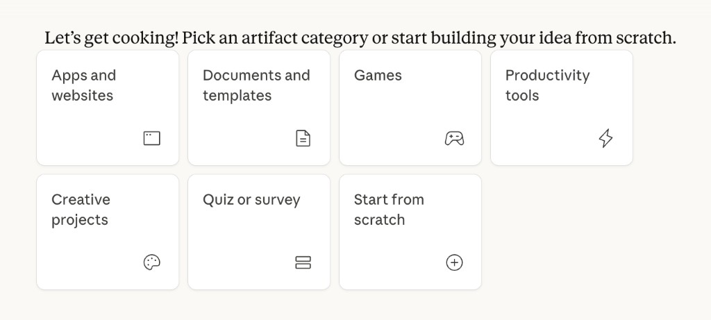

# 討論方式的內容生成

當你有一個主題，想產生 **Markdown 格式**的內容，並希望透過與 AI **反覆討論、逐步優化**，可以善用 Gemini、ChatGPT、Claude 三大工具的「協作編輯」功能。這種模式讓內容不是一次定稿，而是你與 AI 一起打磨到滿意為止。

> 📌 **適合對象**：想學會用 AI 工具產出與編輯內容的學生與職場人士
>
> 📌 **前置學習**：本單元**觸發編輯器的 prompt** 採用 [AI 提示詞工程指南](../prompt/AI提示詞工程指南/README.md) 的 **ROSES 框架**撰寫；**反覆對話、圈選修改**則使用自然語言即可。

---

## 什麼是「討論式編輯器」？

> 一個**可編輯的內容區塊**，出現在對話旁邊。你可以直接改文字、圈選段落請 AI 修改，或透過對話討論，讓內容越改越好。

| 特色 | 說明 |
|------|------|
| **雙欄介面** | 左側對話、右側編輯器，內容與討論並存 |
| **即時編輯** | 直接在編輯器中改字、改段落 |
| **選取討論** | 圈選特定段落，請 AI 針對該段修改或給建議 |
| **迭代優化** | 透過多輪對話，逐步調整語氣、長度、結構 |

---

## 三大工具快速對照

| | **Gemini** | **ChatGPT** | **Claude** |
|---|---|---|---|
| **功能名稱** | Canvas | Canvas（畫布） | Artifacts（工件） |
| **觸發方式** | 描述要產生的內容，自動開啟 | 內容超過 10 行，或說「使用畫布」 | 要求生成長文、程式碼、圖表時自動出現 |
| **直接編輯** | ✅ | ✅ | ✅ |
| **圈選修改** | ✅ | ✅ | ✅ |
| **版本記錄** | ✅ | ✅ | ✅ |
| **匯出格式** | —  | PDF / .md / .docx | — |
| **特別說明** | 無需額外設定 | 可輸入 `/canvas` 強制開啟 | 無需額外設定，預設啟用 |

---

## 產出內容類型對照

三大工具的協作編輯器不僅能產出 Markdown 文件，還能產生**不同類型的結構化內容**。各工具的介面與可選類型不盡相同，使用前可先確認該工具支援的產出類型。

### Claude Artifacts 產出類型

Claude 的 Artifacts 提供明確的**產出類型選單**，可依需求選擇起點：

| 類型 | 說明 |
|------|------|
| **Apps and websites** | 網頁應用程式、前端介面 |
| **Documents and templates** | 結構化文件、報告、範本 |
| **Games** | 互動式遊戲 |
| **Productivity tools** | 計算機、轉換器、小工具等生產力工具 |
| **Creative projects** | 視覺、藝術類創作專案 |
| **Quiz or survey** | 測驗、問卷、表單 |
| **Start from scratch** | 從空白開始，自訂產出類型 |



### Gemini、ChatGPT 的差異

| 工具 | 產出類型說明 |
|------|--------------|
| **Gemini Canvas** | 以 Markdown、程式碼為主，依描述自動判斷產出格式，無獨立類型選單 |
| **ChatGPT Canvas** | 以 Markdown、程式碼為主，可產出圖表、簡報等，依 prompt 自動判斷 |
| **Claude Artifacts** | 提供 7 種預設類型選單，可明確指定產出類別 |

> 💡 **使用建議**：若需特定類型（如網頁、遊戲、問卷），Claude 可先選類型再描述需求；Gemini、ChatGPT 則建議在 prompt 中**明確寫出產出格式**（如「請產生一個可互動的網頁」「請做一份問卷表單」）。更多範例見下方 [不同產出類型的 Prompt 範例](#不同產出類型的-prompt-範例)。

---

## 如何觸發各工具的編輯器？

### 通用原則

| 原則 | 說明 |
|------|------|
| **觸發編輯器時依 ROSES 撰寫** | 首次產出內容的 prompt 需用 ROSES 框架，見 [AI 提示詞工程指南](../prompt/AI提示詞工程指南/README.md) |
| **明確說出「要產出內容」** | 不要只問「什麼是 X」，要說「請寫一篇關於 X 的文章」 |
| **指定格式** | 加上「用 Markdown 格式」「包含標題和條列」 |
| **暗示需要編輯** | 加上「方便我編輯」「我要邊看邊改」 |
| **內容要夠長** | 要求「一篇完整文章」「多個章節」比短句更容易觸發編輯器 |

### 各工具觸發關鍵字

| 工具 | 加入 prompt 的關鍵字 |
|------|----------------------|
| **Gemini** | 「請在 Canvas 中顯示」 |
| **ChatGPT** | 「使用畫布」「在 Canvas 中顯示」`/canvas` |
| **Claude** | 「以 Artifact 形式顯示」「請產生可編輯的 Markdown 文件」 |

### 萬用 Prompt 範本

**主題背景**：你要寫一篇結構完整的分享文，主題為「**我如何用番茄鐘克服拖延**」，讀者是同班同學，希望產出後能與 AI 反覆討論修改。

<details>
<summary>📝 學生發想：先思考再下 prompt（可略過，直接使用下方主題）</summary>

在輸入 prompt 前，請先回答：
- 你的**主題**是什麼？（本範例主題：我如何用番茄鐘克服拖延）
- 這篇文章的**讀者**是誰？（本範例：同班同學）
- 你希望文章包含**哪些部分**？（前言、重點、結語？）

發想完成後，再展開下方建議 prompt 參考使用。

</details>

<details>
<summary>💬 建議 Prompt（點擊展開，運用 ROSES 框架）</summary>

```markdown
## R – 角色設定
你是一位擅長撰寫結構化文章的內容編輯。

## O – 任務目標
幫我寫一篇關於「我如何用番茄鐘克服拖延」的文章。

## S – 執行步驟
1. 前言
2. 主要內容（至少 3 個小節，每節有標題和條列重點）
3. 結語或實務建議

## E – 範例格式
以 Markdown 標題、條列呈現，結構清晰。

## S – 範圍與風格
- 語言：繁體中文
- 格式：Markdown，請在 Canvas / 畫布 / Artifact 中顯示，方便我直接編輯並討論修改
```

</details>

---

## 不同產出類型的 Prompt 範例

以下為**不同類型內容**的觸發 prompt 範例，皆依 ROSES 框架撰寫。產出後可複製至對應工具（Excel、PowerPoint、Canva 等）使用。

### 貪食蛇遊戲（HTML/JavaScript）

**主題背景**：你要做一個簡單的**貪食蛇遊戲**，用網頁呈現，可鍵盤操作，供課堂展示或自學練習。

<details>
<summary>💬 建議 Prompt（ROSES 框架）</summary>

```markdown
## R – 角色設定
你是一位擅長網頁遊戲開發的前端工程師。

## O – 任務目標
幫我產出一個可執行的「貪食蛇」網頁遊戲。

## S – 執行步驟
1. 使用 HTML + JavaScript 實作
2. 蛇可用鍵盤方向鍵控制移動
3. 吃到食物會變長、得分
4. 撞到牆或自己則遊戲結束

## E – 範例格式
單一 HTML 檔案，內含 CSS 與 JavaScript，可直接在瀏覽器開啟執行。

## S – 範圍與風格
- 介面簡潔，適合初學者理解
- 請在 Canvas / 畫布 / Artifact 中顯示，方便我直接編輯
```

</details>

---

### Excel 表單內容（可複製至 xlsx）

**主題背景**：你要產出一份「**社團活動經費申請表**」的欄位與範例資料，之後要貼到 Excel 使用。

<details>
<summary>💬 建議 Prompt（ROSES 框架）</summary>

```markdown
## R – 角色設定
你是一位擅長表單設計的行政人員。

## O – 任務目標
幫我產出一份「社團活動經費申請表」的表格內容，欄位與範例資料可直接複製到 Excel。

## S – 執行步驟
1. 設計欄位：申請日期、活動名稱、預算項目、金額、備註等
2. 提供 3 筆範例資料
3. 以 Markdown 表格或 CSV 格式呈現，方便複製貼上

## E – 範例格式
| 申請日期 | 活動名稱 | 預算項目 | 金額 | 備註 |

## S – 範圍與風格
- 語言：繁體中文
- 格式：Markdown 表格，請在 Canvas / 畫布 / Artifact 中顯示
```

</details>

---

### PPT 簡報大綱

**主題背景**：你要做一份「**AI 工具入門介紹**」的簡報大綱，約 8 頁，之後要貼到 PowerPoint 製作投影片。

<details>
<summary>💬 建議 Prompt（ROSES 框架）</summary>

```markdown
## R – 角色設定
你是一位擅長簡報架構規劃的簡報顧問。

## O – 任務目標
幫我產出一份「AI 工具入門介紹」的簡報大綱，可直接複製到 PowerPoint 製作投影片。

## S – 執行步驟
1. 封面頁（標題、副標、報告人、日期）
2. 6～8 張投影片，每張有標題與 3 個重點
3. 結尾頁（總結或 Q&A）

## E – 範例格式
第 1 張：封面 / 第 2 張：什麼是 AI 工具
  - 重點 1、重點 2、重點 3
（以此類推）

## S – 範圍與風格
- 語言：繁體中文
- 格式：Markdown，結構清晰，每張不超過 3 個重點
- 請在 Canvas / 畫布 / Artifact 中顯示
```

</details>

---

### 資訊圖表需要的內容

**主題背景**：你要做一張「**台灣大學生平均每日使用手機時數**」的資訊圖表，需要 AI 產出圖表所需的**文字、數據、結構**，之後用 Canva 等工具製作視覺。

<details>
<summary>💬 建議 Prompt（ROSES 框架）</summary>

```markdown
## R – 角色設定
你是一位擅長資訊圖表內容規劃的數據視覺化專家。

## O – 任務目標
幫我產出一份「台灣大學生平均每日使用手機時數」資訊圖表所需的內容與結構。

## S – 執行步驟
1. 標題與副標
2. 3～5 個數據重點（可引用統計或合理推估）
3. 每個重點的簡短說明（20 字以內）
4. 建議的視覺呈現方式（如：長條圖、圓餅圖、時間軸）

## E – 範例格式
以條列與表格呈現，標明「圖表區塊 1」「圖表區塊 2」，方便後續在 Canva 排版。

## S – 範圍與風格
- 語言：繁體中文
- 格式：Markdown，結構清晰、適合轉成資訊圖表
- 請在 Canvas / 畫布 / Artifact 中顯示
```

</details>

---

## 在編輯器中如何討論與修改？

### 三工具操作對照

| 操作 | Gemini Canvas | ChatGPT Canvas | Claude Artifacts |
|------|--------------|----------------|-----------------|
| **直接改文字** | 點擊後直接輸入 | 點擊後直接輸入 | 點擊後直接輸入 |
| **圈選修改** | 選取 → 點「選擇並詢問」| 反白 → 跳出輸入框 | 圈選後在對話框說明 |
| **快捷調整** | 語氣、長度按鈕 | 建議編輯、調整長度、變更閱讀程度 | 透過對話指令 |
| **版本還原** | 點「上一版本」 | 頂端箭頭切換 | 左下角版本紀錄 |

### 反覆對話：用自然語言即可

編輯器開啟後，**圈選修改、多輪優化**的對話**不需**套用 ROSES，直接用自然語言說出你的需求即可。例如：「這段改得更口語一點」「加一個具體例子」「這裡加上優先級欄位」。

### 四種討論模式（適用所有工具）

1. **問建議**：「這段的結構有沒有更好的寫法？」
2. **問原理**：「為什麼要這樣分段？」
3. **問可行性**：「這個範例適合給初學者嗎？」
4. **問除錯**：「這段程式碼哪裡有問題？」

---

## 完整範例：從主題到優化

**主題背景**：你是**吉他社**社團幹部，每週三晚上有社團會議。現有會議記錄格式不統一，你希望產出一份「**吉他社社團會議記錄範本**」供未來使用，並能依實際需求逐步調整。

<details>
<summary>📝 學生發想：先思考再下 prompt（可略過，直接使用下方 prompt）</summary>

在輸入 prompt 前，請先思考：
- 一份完整的會議記錄通常需要**哪些欄位**？（本範例：會議資訊、出席人員、討論重點、決議事項、待辦事項）
- 你的社團會議最常討論**什麼類型**的內容？（本範例：吉他社的練團進度、活動籌備）
- 誰會使用這份範本？（本範例：社長、幹部、指導老師）

</details>

<details>
<summary>💬 第一步：觸發編輯器的 Prompt（運用 ROSES 框架）</summary>

```markdown
## R – 角色設定
你是一位擅長會議紀錄整理的行政秘書。

## O – 任務目標
幫我產出一份「吉他社社團會議記錄範本」，供每週三社團會議使用。

## S – 執行步驟
1. 會議資訊（日期、時間、地點、主席）
2. 出席人員
3. 討論重點
4. 決議事項
5. 待辦事項（負責人、截止日）

## E – 範例格式
各欄位以 Markdown 標題與表格呈現，待辦事項使用表格格式。

## S – 範圍與風格
- 語言：繁體中文
- 格式：Markdown，結構清晰、方便後續編輯
- 請在 Canvas / 畫布 / Artifact 中顯示，我要直接編輯
```

</details>

<details>
<summary>💬 第二步：圈選「待辦事項」表格後輸入（自然語言）</summary>

```markdown
這個表格加上「優先級」欄位，並把格式改得更簡潔。
```

</details>

<details>
<summary>💬 第三步：繼續對話優化（自然語言）</summary>

```markdown
決議事項和待辦事項之間，加一個「下次會議時間」區塊。
```

</details>

> 每一輪 AI 都只修改你指定的部分，其他內容保持不變。

---

## 🎯 學生練習題

以下三個練習從簡單到進階，建議依序完成。

---

### 練習一：觸發編輯器（基礎）

**主題背景**：主題為「**時間管理的 5 個技巧**」，讀者是大學生，語氣輕鬆實用。你要產出一篇文章提醒自己、也方便分享給同學。

**目標**：成功在任一工具中開啟協作編輯器，並產生 Markdown 文件。

<details>
<summary>📝 學生發想：先思考再下 prompt（可略過，直接使用下方 prompt）</summary>

在輸入 prompt 前，請先發想：
- 本練習主題：**時間管理的 5 個技巧**
- 讀者：大學生
- 語氣：輕鬆、實用

</details>

**步驟**：
1. 打開 Gemini、ChatGPT 或 Claude
2. 依你的發想，撰寫 prompt 並輸入（可參考下方建議）

<details>
<summary>💬 建議 Prompt（點擊展開，可依發想修改主題，運用 ROSES 框架）</summary>

```markdown
## R – 角色設定
你是一位擅長時間管理與生產力提升的教練。

## O – 任務目標
幫我寫一篇「時間管理的 5 個技巧」文章。

## S – 執行步驟
1. 前言
2. 5 個技巧（各有小標題和說明）
3. 結語

## E – 範例格式
以 Markdown 標題、條列呈現，每個技巧有小標題與 2～3 句說明。

## S – 範圍與風格
- 語言：繁體中文
- 格式：Markdown，請在 Canvas / 畫布 / Artifact 中顯示
```

</details>

3. 確認右側出現編輯器視窗

**繳交內容**：截圖編輯器畫面，標出「左側對話」和「右側編輯器」的位置。

---

### 練習二：圈選修改（中級）

**主題背景**：延續練習一產出的「**時間管理的 5 個技巧**」文章。你要修改兩處：① 其中一個技巧的段落（改得更口語、加具體例子）；② 結語（加上「今天就開始行動」的呼籲）。其他內容不變。

**目標**：學會圈選特定段落，請 AI 針對性修改，而不影響其他內容。

<details>
<summary>📝 學生發想：先思考再圈選修改（可略過，直接使用下方 prompt）</summary>

本練習要修改的兩處：
- ① 圈選**其中一個技巧的段落**，改成口語、加具體例子
- ② 圈選**結語段落**，加上行動呼籲

</details>

**步驟**：
1. 延續練習一的文件，或重新產生一份
2. 圈選其中**一個技巧的段落**，輸入你的修改指令（可參考下方）

<details>
<summary>💬 建議 Prompt 1：修改單一技巧段落（自然語言）</summary>

```markdown
這段改得更口語、更貼近大學生的生活經驗，並加一個具體例子。
```

</details>

3. 再圈選**結語段落**，輸入你的修改指令（可參考下方）

<details>
<summary>💬 建議 Prompt 2：修改結語（自然語言）</summary>

```markdown
結語加上一句鼓勵讀者「今天就開始行動」的呼籲。
```

</details>

**繳交內容**：修改前後的截圖對照，並說明你圈選了哪個段落、下了什麼指令。

---

### 練習三：多輪討論優化（進階）

**主題背景**：主題為「**113 學年度上學期讀書計畫**」，目標是通過多益 500 分。你要 AI 先產出一份範本，再透過 5 輪對話逐步加入：SMART 目標說明、完成度欄位、費曼學習法、活潑語氣、月底回顧區塊。

**目標**：透過至少 **5 輪對話**，將一份草稿打磨成完整文件。

<details>
<summary>📝 學生發想：先規劃再產出（可略過，直接使用下方 prompt）</summary>

本練習主題與 5 輪修改重點：
- 主題：**113 學年度上學期讀書計畫**（目標：多益 500 分）
- 第 1 輪：加 SMART 原則
- 第 2 輪：加完成度欄位
- 第 3 輪：加費曼學習法
- 第 4 輪：改語氣更活潑
- 第 5 輪：加月底回顧區塊

</details>

**步驟**：
1. 依你的發想，撰寫 prompt 產生初稿（可參考下方）

<details>
<summary>💬 建議 Prompt：產生初稿（運用 ROSES 框架）</summary>

```markdown
## R – 角色設定
你是一位擅長學習規劃與目標設定的教育顧問。

## O – 任務目標
幫我產出一份「113 學年度上學期讀書計畫」範本，學期目標為通過多益 500 分。

## S – 執行步驟
1. 目標設定（學期目標：多益 500 分）
2. 每週計畫表格
3. 複習策略
4. 自我檢核清單

## E – 範例格式
以 Markdown 標題、表格、條列呈現，結構清晰。

## S – 範圍與風格
- 語言：繁體中文
- 格式：Markdown，請在 Canvas / 畫布 / Artifact 中顯示
```

</details>

2. 進行至少 5 輪修改，每輪先思考「這份計畫還缺什麼」，再下指令（可參考下方範例，用自然語言即可）

<details>
<summary>💬 建議 Prompt：5 輪修改範例（自然語言）</summary>

| 輪次 | 建議指令 |
|------|----------|
| 第 1 輪 | 目標設定加上 SMART 原則的說明 |
| 第 2 輪 | 每週計畫表格加上「完成度」欄位 |
| 第 3 輪 | 複習策略改用條列式，並加上費曼學習法的介紹 |
| 第 4 輪 | 整份文件的語氣改得更活潑，適合大學生閱讀 |
| 第 5 輪 | 最後加上一個「月底回顧」的區塊 |

</details>

**繳交內容**：最終文件截圖 + 記錄每輪你下的指令與 AI 的修改結果。

---

## 快速參考卡

| 想做的事 | 建議 prompt 關鍵字 |
|----------|-------------------|
| **觸發編輯器**（首次產出） | 依 [ROSES 框架](../prompt/AI提示詞工程指南/README.md#roses-提示框架) 撰寫，含「在 Canvas/畫布/Artifact 中顯示」 |
| **不同產出類型** | 遊戲、Excel 表單、PPT 大綱、資訊圖表內容等，見 [不同產出類型的 Prompt 範例](#不同產出類型的-prompt-範例) |
| **反覆對話、圈選修改** | 用**自然語言**直接說出需求即可，例如：「這段改得更口語」「加一個具體例子」 |
| 沒有跳出編輯器 | 明確加上「使用畫布」「在 Canvas 中顯示」「以 Artifact 顯示」 |
| 只修改某一段 | 先**圈選**該段，再用自然語言說明要怎麼改 |

> 💡 **重要提醒**：圈選段落再下指令，AI 才能精準修改你要的部分，而不是重寫整篇。這是協作編輯最關鍵的技巧！